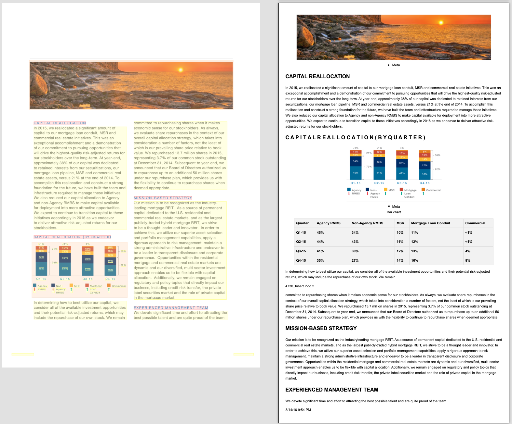
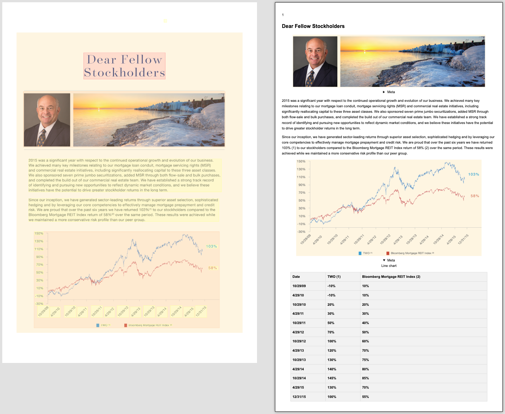

When teams say they want to "extract charts from PDFs," they usually mean something very concrete: they want the values behind bars, lines, and pie slices, not just another image. That is harder than it sounds. Charts are visual encodings, axis labels can be rotated or crowded, legends can overlap the plot area, and source PDFs are often noisy or low quality.

Docling addresses this gap by enriching picture elements during conversion and attaching machine-readable chart tables to chart-like images. In practice, this gives you a path from "figure in a PDF" to "structured values I can validate and use in analytics, RAG, or agents."

## Why This Matters in Real Workflows

In many reports and papers, the key numbers are present only inside charts. Teams often end up building brittle custom pipelines that crop figures, run OCR, and infer values from geometry. Those approaches can work for one template, then break on the next export style.

Docling moves that effort into a standard conversion pipeline. Instead of treating each chart as a one-off parsing problem, you get a consistent metadata structure that can be validated and stored.

## Visual Examples from Docling

The following examples show Docling layout output with chart extraction enabled on the sample chart document.


*Figure 1. Bar chart example produced from `./docs/examples/data/chart_document.pdf`.*


*Figure 2. Line chart example produced from `./docs/examples/data/chart_document.pdf`.*

## What Gets Added to the Pipeline

When chart extraction is enabled, Docling does more than plain text parsing. It classifies picture elements and enriches chart-like items with extracted table data. At the moment, the official chart extraction path focuses on bar, pie, and line charts, with extracted data available in Python at `PictureItem.meta.tabular_chart.chart_data`.

A useful way to think about this is as a two-step process. First, Docling converts pages into typed document elements such as text blocks, tables, and images. Then it enriches relevant picture elements with inferred tabular values. The result is not only a rendered document, but also chart metadata that can be consumed programmatically.

## CLI Walkthrough

The CLI is the fastest way to validate behavior on a real PDF:

```bash
# 1) Install Docling with VLM support
pip install "docling[vlm]"

# 2) Run conversion with chart extraction enabled
uv run docling --from pdf --to html_split_page --show-layout --enrich-chart-extraction ./docs/examples/data/
  chart_document.pdf
```

This command runs conversion with chart enrichment enabled and produces output you can inspect immediately. A practical starting pattern is to test one representative PDF first, inspect quality carefully, and only then scale out to a larger corpus.

## Python Walkthrough

For programmatic workflows, configure `PdfPipelineOptions`, convert once, then inspect `PictureItem` metadata.

```python
from pathlib import Path
import pandas as pd

from docling.datamodel.base_models import InputFormat
from docling.datamodel.pipeline_options import PdfPipelineOptions
from docling.document_converter import DocumentConverter, PdfFormatOption
from docling_core.types.doc import PictureItem

pdf_path = Path("reports/market-report.pdf")

pipeline_options = PdfPipelineOptions()
pipeline_options.do_chart_extraction = True

converter = DocumentConverter(
    format_options={
        InputFormat.PDF: PdfFormatOption(pipeline_options=pipeline_options)
    }
)

result = converter.convert(pdf_path)

for item, _ in result.document.iterate_items():
    if not isinstance(item, PictureItem):
        continue
    if item.meta is None or item.meta.tabular_chart is None:
        continue

    chart_data = item.meta.tabular_chart.chart_data

    # Rebuild extracted grid as a DataFrame
    grid = [["" for _ in range(chart_data.num_cols)] for _ in range(chart_data.num_rows)]
    for cell in chart_data.table_cells:
        grid[cell.start_row_offset_idx][cell.start_col_offset_idx] = cell.text

    df = pd.DataFrame(grid)
    print(df.to_csv(index=False, header=False))
```

The important detail in this flow is that extracted chart data is returned as cell objects with row and column offsets. Reconstructing the 2D grid gives you a form that is easy to validate, compare, and export. If you use this in production, it is worth persisting provenance such as source file, page number, and figure index so you can trace outputs during debugging and reviews.

## Performance and Model Notes

Docling chart extraction uses `ibm-granite/granite-vision-3.3-2b-chart2csv-preview` for the chart-to-table step. On the model card's internal Chart2CSV benchmark, the reported scores are:

| Model | Chart2CSV Score |
|---|---:|
| chartgemma | 37.1 |
| granite-vision-3.3-2b | 53.8 |
| Qwen3-VL-4B-Instruct | 58.1 |
| InternVL3-8B | 56.1 |
| Pixtral-12B-2409 | 49.1 |
| Qwen2-VL-72B-Instruct | 50.3 |
| GPT-4o | 46.7 |
| **granite-vision-3.3-2b-chart2csv-preview** | **60.1** |

The same family also reports `0.87` on ChartQA in the public evaluation table. These numbers are useful directional signals, but they are not guarantees for every document style. In practice, accuracy still depends on chart clarity, resolution, visual clutter, and labeling conventions.

## Running This Safely in Production

A robust pipeline usually follows a simple rhythm: run conversion with chart enrichment enabled, store extracted tables with provenance, and apply lightweight validation before downstream use. Even basic checks on shape, numeric parsing, plausible ranges, and label presence can remove many silent failures.

It also helps to avoid treating extraction as all-or-nothing. High-confidence outputs can flow automatically, while ambiguous or low-quality extractions can be flagged for review. This hybrid model preserves automation speed without hiding risk.

## Common Pitfalls

Low-resolution scans, heavily stylized charts, and crowded multi-series plots can all reduce extraction quality. Another common mistake is assuming every picture is a chart. In code, always guard for missing metadata and process only items where chart enrichment is actually present.

The key mindset is to design for variance. Real document collections are messy, and stable systems expect imperfect input.

## Recap

Docling turns chart extraction from an ad-hoc vision task into a repeatable document-processing component. You convert once, enrich chart elements, reconstruct tabular values, validate what matters, and keep provenance so outputs stay inspectable.

## References

- [Docling CLI reference](https://docling-project.github.io/docling/reference/cli/)
- [Docling chart extraction example](https://github.com/docling-project/docling/blob/main/docs/examples/chart_extraction.py)
- [Granite Chart2CSV model card](https://huggingface.co/ibm-granite/granite-vision-3.3-2b-chart2csv-preview)
- [Granite Vision 3.3 model card](https://huggingface.co/ibm-granite/granite-vision-3.3-2b)
