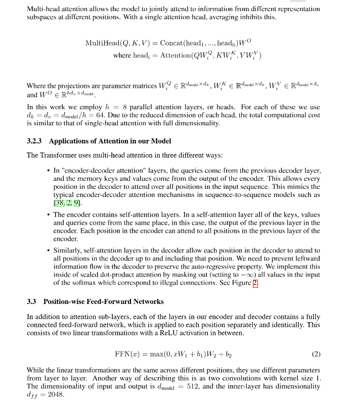
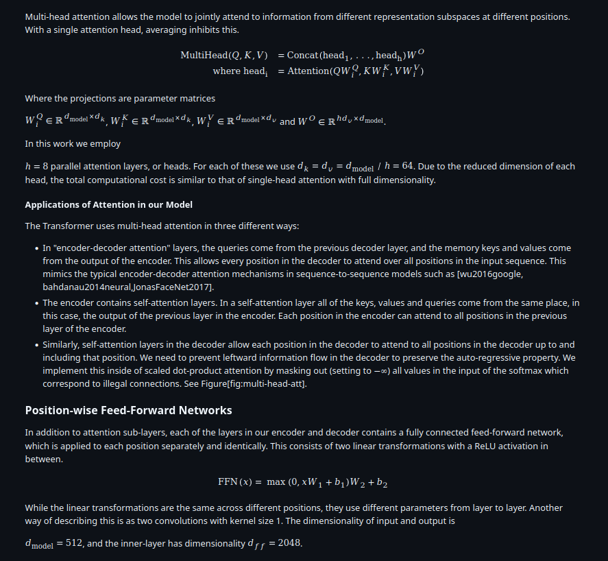
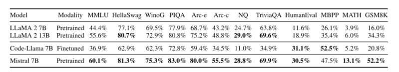
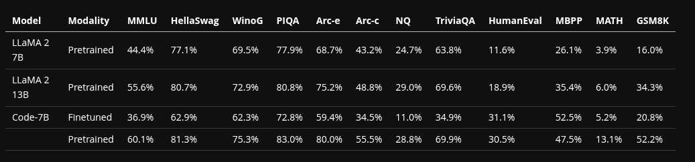
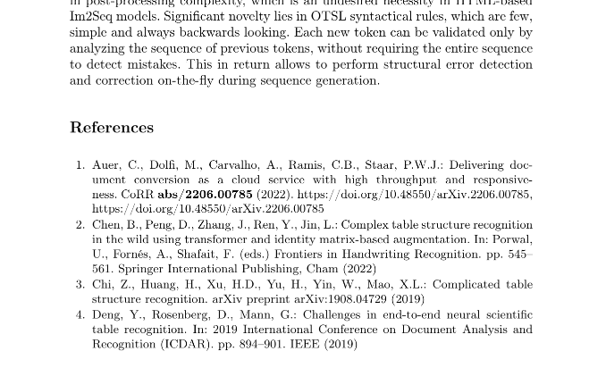
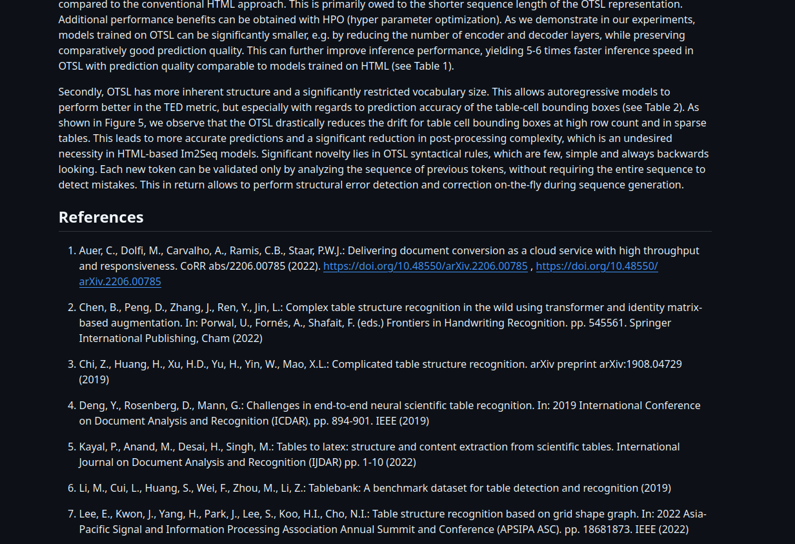

Much of the world's technical knowledge still lives as LaTeX source. Papers, preprints, reports, theses, and internal research notes are often authored in `.tex`, compiled to PDF, and only then passed to extraction systems. That workflow works, but it throws away information that was explicit in the source and forces later stages to reconstruct it from layout.

Docling's LaTeX backend takes the direct route. Instead of treating LaTeX as something that must first become a PDF, it parses the source itself and maps it into Docling's structured document model. Headings stay headings, math stays math, tables stay tables, and references remain usable content instead of visual artifacts.

## Why direct LaTeX parsing matters

Working from source lets Docling preserve that structure before it is flattened by rendering.

PDF extraction is often a recovery problem. You start with rendered pages and try to infer what the author meant from coordinates, fonts, spacing, and reading order.

## Visual examples from Docling

### Math survives as math

Equations are usually the first thing to degrade in weak converters. In Docling's LaTeX flow, inline math stays embedded in the surrounding text, while display math becomes formula items in the document model.

<table>
<tr>
<td width="50%" align="center" valign="top">

<p><em>Original source with inline and display math.</em></p>
</td>
<td width="50%" align="center" valign="top">

<p><em>Docling output with math preserved as math.</em></p>
</td>
</tr>
</table>

### Tables come through as structure

The backend parses table content into structured cells, including common merged-cell patterns. That matters because downstream systems can validate and consume real table structure instead of parsing plain text that only looks tabular to a human reader.

<table>
<tr>
<td align="center" valign="top">

<p><em>Source table with structure that should survive conversion.</em></p>
</td>
</tr>
<tr>
<td align="center" valign="top">

<p><em>Docling output with rows, columns, and spans carried through.</em></p>
</td>
</tr>
</table>

### References stay readable

Bibliographies are part of the usable knowledge in technical documents. Docling keeps them as structured content instead of dropping them during conversion.

<table>
<tr>
<td width="50%" align="center" valign="top">

<p><em>Source bibliography and citation content.</em></p>
</td>
<td width="50%" align="center" valign="top">

<p><em>Docling output with references kept as usable text.</em></p>
</td>
</tr>
</table>

## How the backend works

The LaTeX backend is implemented in `docling/backend/latex/` and is built around a tolerant parse-tree walk. The repository layout already tells a useful part of the story:

```text
docling/docling/backend/latex/
├── __init__.py
├── backend.py
├── constants.py
├── context.py
├── engines/
│   ├── __init__.py
│   └── base.py
├── handlers/
│   ├── __init__.py
│   ├── environments.py
│   ├── macros.py
│   └── math.py
├── libraries/
│   ├── __init__.py
│   └── base.py
└── utils/
    ├── __init__.py
    ├── encoding.py
    ├── table.py
    └── text.py
```

Most of the tree is a clean separation of concerns: `backend.py` orchestrates the conversion flow, `handlers/` contains the semantic mapping logic for macros, environments, and math, and `utils/` holds the lower-level helpers for encoding, text extraction, and table parsing.

The `engines/` and `libraries/` directories are especially important for maintainability. Today, they are best read as extension scaffolding: base abstractions that define a clean place for future LaTeX-native integrations and package-specific handlers. That matters because it gives the project a way to grow support for library-specific behavior without pushing every special case directly into the core walker.

That separation matters because real LaTeX corpora are rarely plain vanilla LaTeX. They often depend on journal templates, theorem packages, bibliography tooling, graphics helpers, and domain-specific macro sets. Keeping a clear extension boundary makes it much easier to add support incrementally while keeping the core backend readable and stable.

A second useful way to think about it is as a staged pipeline:

### 1. Decode the source and normalize a few common shorthands

The backend first reads the source using a small encoding fallback chain: UTF-8, Latin-1, then CP1252. Before parsing, it also normalizes a few common shorthand patterns. This is intentionally small and pragmatic rather than a full TeX expansion system.

### 2. Parse with `pylatexenc` in tolerant mode

Docling uses `LatexWalker(..., tolerant_parsing=True)` to build a LaTeX node tree. That choice is important: research LaTeX is messy, often split across files, and full of package-specific macros. Tolerant parsing increases the chance of producing a useful document even when the source is not perfectly clean.

### 3. Extract metadata and simple custom macros

Before processing the main body, the backend scans the preamble for basic document metadata and collects simple custom macro definitions.

Those definitions are then expanded later during text and math extraction, which helps preserve meaning in author-defined notation without trying to fully emulate a TeX engine.

### 4. Follow the document body, not the rendering engine

Once the tree is built, the backend looks for the main document body. If it finds one, it processes that body. If not, it still processes the available nodes, which makes the converter more forgiving on partial or unusual inputs.

From there, the walk dispatches by node type:

- character nodes become text buffers and paragraphs
- macro nodes are handled by dedicated macro logic
- environment nodes are routed to environment handlers
- math nodes are split into inline versus display math
- groups are either flattened into text or recursively processed

### 5. Map LaTeX constructs into Docling items

This is where the source becomes a structured document. The current backend covers a broad and practical slice of technical authoring:

- document hierarchy and abstract content
- inline and display math
- theorem-style statements and proofs preserved as structured text blocks
- lists and list items
- tables and figures
- code blocks and verbatim text
- bibliography sections and inline references
- footnotes, hyperlinks, escaped characters, and content inside common inline formatting macros

## What is especially useful in practice

Several implementation choices in the backend make a large difference on real projects.

### Multi-file papers are handled directly

When the source is split across multiple files, Docling resolves those references relative to the main file and parses them recursively. There is protection against cycles, and recursion is capped at 10 levels to avoid runaway inclusion.

For real research papers, this matters a lot. It is common to split introductions, methods, appendices, and tables across separate files.

### Figures are preserved even when assets are missing

When conversion starts from a file path on disk, the backend tries to resolve referenced figure assets as well. Raster images are loaded directly, and PDF assets are rendered to an image before attachment. If an image file is missing, Docling still creates the picture item and keeps figure context, including explicit captions when present, so the structural trace is not lost.

### Tables stay machine-readable

The table parser does not just dump table text. It creates cell objects with row and column offsets, and it preserves common span behavior. That is much closer to what downstream analytics, extraction, and agent workflows need.

### Unknown macros degrade gracefully

LaTeX in the wild is full of local commands and package-specific notation. When the backend does not recognize a macro as a special structural construct, it still tries to extract the content of its arguments instead of silently discarding it. That fallback is one of the reasons the converter remains useful on heterogeneous source trees.

## What the backend is not trying to do

The easiest way to understand the boundary here is to remember that LaTeX is not just markup. It is a programmable typesetting system. In that sense, trying to recover a clean semantic structure from arbitrary LaTeX source can be a bit like being asked to convert this:

```
 _        _   _____  _______  __
| |      / \ |_   _|| ____\ \/ /
| |     / _ \  | |  |  _|  \  / 
| |___ / ___ \ | |  | |___ /  \ 
|_____/_/   \_\|_|  |_____/_/\_\

```

into canonical LATEX.

You can see what it says, but there is no single correct source form hiding behind it. The same visible result could have been produced by many different macros, packages, spacing tricks, local commands, or author conventions. That is why a source converter should be careful about pretending it fully understands every possible TeX program.

This backend does not try to be a full TeX engine. It does not compile the document, execute package logic, or reproduce every macro-expansion edge case. That is a deliberate boundary.

The goal is different: recover as much semantic structure as possible and fail softly when the source is too irregular to interpret perfectly.

## CLI walkthrough

The CLI is the fastest way to validate behavior on a real `.tex` file:

```bash
pip install docling

# Convert a LaTeX source file to Markdown
docling paper.tex --from latex --to md --output ./out
```

## Python walkthrough

For programmatic workflows, LaTeX plugs into the same `DocumentConverter` interface as the other Docling input formats:

```python
from docling.document_converter import DocumentConverter

converter = DocumentConverter()
result = converter.convert("paper.tex")

markdown = result.document.export_to_markdown()
print(markdown)
```

## Recap

Docling turns LaTeX conversion from a compile-then-extract workflow into a direct source-to-structure step. The backend reads `.tex`, walks a tolerant parse tree, preserves the constructs that matter, and falls back safely when the source gets ugly.

For technical corpora, that is the right level of abstraction. You do not want equations reverse-engineered from glyphs or bibliography sections reconstructed from layout if the source already told you exactly what they were.

For readers who want to inspect the implementation directly, these are the most useful entry points.

## References

- [Docling repository](https://github.com/docling-project/docling)
- [LaTeX backend entry point](https://github.com/docling-project/docling/blob/main/docling/backend/latex/backend.py)
- [LaTeX macro handlers](https://github.com/docling-project/docling/blob/main/docling/backend/latex/handlers/macros.py)
- [LaTeX environment handlers](https://github.com/docling-project/docling/blob/main/docling/backend/latex/handlers/environments.py)
- [LaTeX backend tests](https://github.com/docling-project/docling/blob/main/tests/test_backend_latex.py)
