<style>
dialog.lb { padding: 0; border: none; background: transparent; max-width: 95vw; max-height: 95vh; }
dialog.lb::backdrop { background: rgba(0,0,0,0.85); cursor: zoom-out; }
dialog.lb img { max-width: 95vw; max-height: 95vh; object-fit: contain; display: block; }
figure img { cursor: zoom-in; }
</style>

Document layout analysis — the task of locating and classifying elements such as titles, tables, figures, and text blocks within a page — is a cornerstone of modern document AI pipelines.
Yet evaluating how well a model performs this task turns out to be surprisingly tricky.
Three fundamental difficulties stand out immediately:

- The most widely used metric, mean Average Precision (mAP), is known to have many limitations that make it inappropriate for evaluating document layout analysis.
- Most evaluation methods only apply when both layout resolutions use the same class taxonomy. This excludes cases such as:
    - Evaluating a model on an annotated dataset that uses a different class taxonomy.
    - Evaluating two models against each other on a non-annotated dataset, where each model uses its own class taxonomy.
- Efficiently computing the metric on the CPU, e.g. using Single Instruction Multiple Data (SIMD) operations.

In this article we will present the **"Taxonomy-invariant Object Recognition Evaluation (TORE)"** method, which overcomes all of the above limitations.

In a typical TORE workflow the following steps take place:
- Rasterize the reference and predicted layout resolutions (bounding boxes + labels).
  - Each resolution is projected on top of the input image.
  - Each rasterized pixel is assigned one or more labels.
  - Assign the special class "Background" to the pixels without any annotation/detection.
  - The reference resolution can be either ground-truth annotations or the detections of a "reference" model.
- Convert the rasterized layout resolutions into a compressed binary format.
  - Each pixel is represented by a `uint64` number.
  - Only unique combinations of `(reference, predicted)` pixel pairs take part in the computation.
- Compute the Confusion Matrix and its derivatives Recall Matrix and Precision Matrix.
- Reduce the matrices to their `2x2` variants by collapsing the non-background classes together.

In the next sections we provide more insight.


## 1. Evaluation Challenges in Layout Analysis

As has already been observed (see [[1]][1], [[4]][4], [[5]][5]), mean Average Precision suffers from several notable limitations.
Most critically, mAP becomes meaningless when predictions lack confidence scores. Without a ranking mechanism, the Precision-Recall curve degenerates into a single point, rendering Average Precision nonsensical.
However, many models provide predictions without confidence scores.
Beyond this, mAP treats all predictions that meet the minimum IoU threshold as equally valid, regardless of how precisely they overlap with the ground truth.
Implementation details such as PR curve interpolation, area computation methods, and caps on the number of predictions per image have also been shown to affect the evaluation results.
Finally, mAP offers no diagnostic value: it provides no insight into which classes a model excels at or struggles with — information that would be invaluable during model development.

A qualitative study of layout analysis in real-world documents reveals that the high complexity of documents often yields ambiguous annotations.
As shown in Figure 1, it is not clear whether the ground-truth data (left) or the model predictions (right) are correct — or whether both are valid layout resolutions.
In this example, the main body of the page is annotated as one large `Picture`. The model, however, predicts a more detailed layout: textual elements are identified as `Section-Header`, `Text`, and `List-Item`, and the picture bounding boxes are reduced to cover only the visual content.

<figure>
  <figcaption style="font-size: 1.1em; font-weight: 600; font-style: italic; margin-bottom: 0.5em;"><em>Figure 1. Ambiguous document layout analysis predictions.</em></figcaption>
  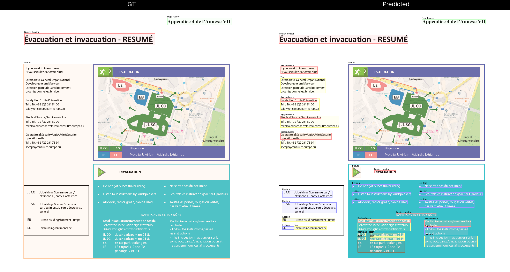
  <dialog class="lb" onclick="this.close()"></dialog>
</figure>
<!-- 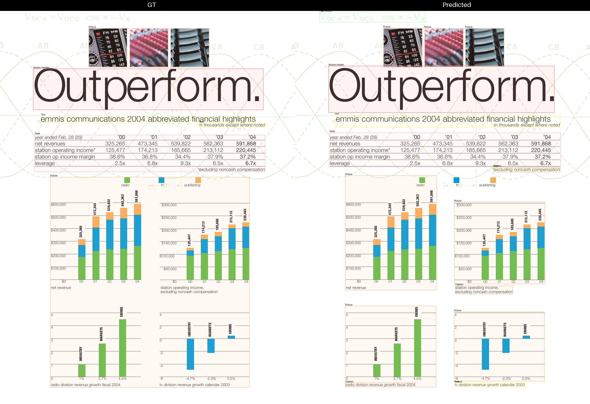 -->


## 2. Single Taxonomy Confusion Matrix and Derivatives

A confusion matrix is a tabular representation of a classifier’s predictions, where each row corresponds to a ground-truth class and each column to a predicted class.
The element `c[i,j]` denotes the number of pixels belonging to class `i` that were predicted as class `j`.
For a perfect classifier, the confusion matrix is purely diagonal.
In real-life classifications, the diagonal entries quantify correct predictions and count as "Gains",
while the off-diagonal entries correspond to mis-predictions and count as "Penalties".

In Figure 2 we can see a Confusion Matrix built for the classes `C1, C2, ... , Cn` and the special "Background" class `BG`.

<figure>
  <figcaption style="font-size: 1.1em; font-weight: 600; font-style: italic; margin-bottom: 0.5em;"><em>Figure 2. The Confusion Matrix quantifies the strengths and weaknesses of the predictions both globally and on a per-class basis</em></figcaption>
  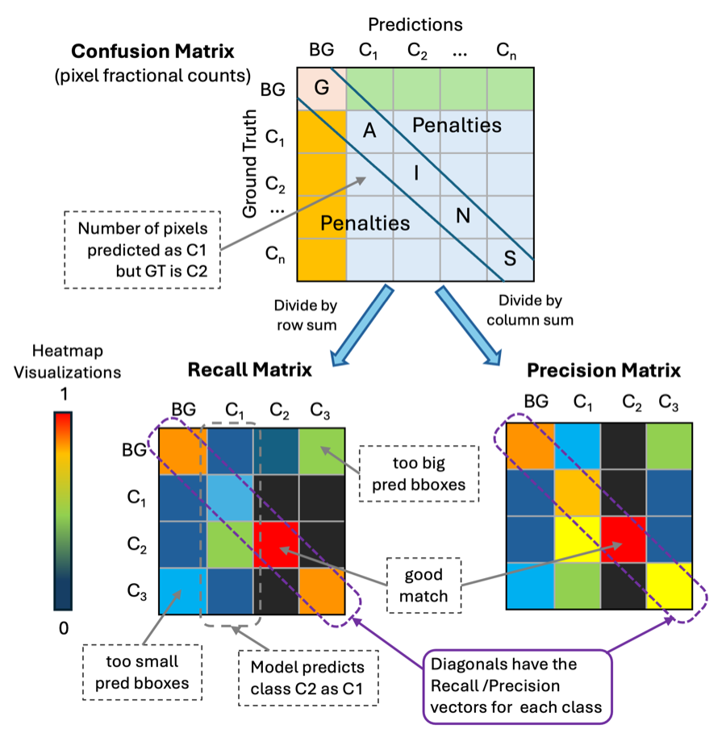
  <dialog class="lb" onclick="this.close()"></dialog>
</figure>

Several performance measures can be derived from the confusion matrix:

- **Recall matrix (row-wise normalized confusion matrix):** Provides a class-wise overview of recall. It shows how accurately each class is predicted and highlights systematic confusions, e.g., “class (X) is misclassified as class (Y) with this frequency”.
- **Precision matrix (column-wise normalized confusion matrix):** Provides a class-wise overview of precision by showing how reliable the predictions of each class are.
- **Recall and precision vectors:** Contain the exact recall and precision values for each class individually.

Finally, the confusion matrix and its derived recall and precision matrices can be visualized effectively using heatmaps, enabling intuitive inspection of prediction patterns and systematic errors.


<a id="3-building-the-confusion-matrix"></a>
## 3. Building the Confusion Matrix

Document layout analysis is a multi-class, multi-label task: it involves multiple classes, and a prediction can assign multiple labels to the same pixel due to bounding-box overlaps.
We can compute the confusion matrix per page by applying the approach of [[3]][3] for each pixel.
The main idea of [[3]][3] is the _"Algorithm 1"_ listed on page 9, which distinguishes 4 cases and assigns fractional _"Gains"_ and _"Penalties"_ for each sample of the dataset.
These 4 cases are:

- Case 1: The prediction has assigned to the sample the same label as in ground-truth (perfect match).
- Case 2: The prediction has assigned to the sample the label of the ground-truth plus some additional wrong label(s) (over-prediction).
- Case 3: The prediction has assigned to the sample only a subset of the ground-truth labels (under-prediction).
- Case 4: Predicted and ground-truth labels have some partial overlap and some diff (diff-prediction).

The "TORE" algorithm is an application of "Algorithm 1" for the use case where the samples are image pixels.
Additionally in TORE we omit case 3, as the ground-truth has single-label annotations.
First we compute the confusion matrix for all pixels of a page and then we sum up to produce the dataset-level confusion matrix.


## 4. Example 1: TORE with a Single Taxonomy

In the next example we will show what the confusion, recall and precision matrices look like when we apply the TORE metric on the "Heron" model for document layout analysis
([[1] "Advanced Layout Analysis Models for Docling"][1], [[2] "Heron - Docling"][2]).

The "Heron" model uses a taxonomy of 17 classes:

```python
[
    "Caption", "Footnote", "Formula", "List-item", "Page-footer", "Page-header", "Picture",
    "Section-header", "Table", "Text", "Title", "Document Index", "Code",
    "Checkbox-Selected", "Checkbox-Unselected", "Form", "Key-Value Region"
]
```

Additionally, the class `"Background"` has been added as the first row/column.

Figure 3 shows the "Confusion Matrix" of the model against the DocLayNet-v2 dataset, which uses the same class taxonomy.
The rows correspond to the ground-truth, the columns to the predictions and each `cell(i,j)` shows the number of pixels that belong to `class-i` but have been predicted as `class-j`.
Notice that the pixel counts are fractional, due to the way the algorithm distributes "gains" and "penalties" for each predicted label.
We use a color code to indicate the magnitude of the cell counts and highlight the main diagonal with pink.

<figure>
  <figcaption style="font-size: 1.1em; font-weight: 600; font-style: italic; margin-bottom: 0.5em;"><em>Figure 3. The Confusion Matrix of Heron model on the DocLayNet v2 dataset</em></figcaption>
  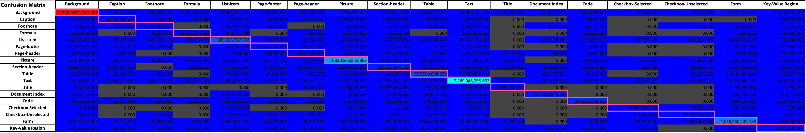
  <dialog class="lb" onclick="this.close()"></dialog>
</figure>

If we normalize the confusion matrix row-wise (dividing each cell by the sum of its row), we get the "Recall Matrix", as shown in Figure 4.
Given that an ideal recall matrix has values only on the main diagonal, the perfect predictor should have red cells on the diagonal and black elsewhere.

As we can see in the example of "Heron" the recall matrix provides invaluable insight into the performance of the model.
We can immediately see for which classes the model performs well or poorly, and, in case of misclassifications, which classes the model confuses.
For example we can see that "Heron" performs excellently on "Background" and quite well for the classes: "Picture", "Table", "Text", "Document Index", "Code" and "Form".
The recall for "Checkbox-Selected" and "Checkbox-Unselected" is still high but a bit lower.
The model lacks recall mostly for the classes "Key-Value Region" and "Title".
Also the recall reveals that "Heron" tends to mis-classify "Title" as "Section-Header".

If we extract the main diagonal elements we get the _Recall Vector_.

<figure>
  <figcaption style="font-size: 1.1em; font-weight: 600; font-style: italic; margin-bottom: 0.5em;"><em>Figure 4. The Recall Matrix of Heron model on the DocLayNet v2 dataset</em></figcaption>
  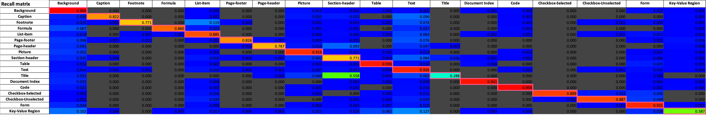
  <dialog class="lb" onclick="this.close()"></dialog>
</figure>

The Precision Matrix is the normalization of the confusion matrix column-wise (dividing each cell by the sum of its column).
This is shown in Figure 5.
The precision matrix can also help to derive interesting conclusions about the performance of a model.
For example we see a high off-diagonal value for the cell `["Background", "Key-Value Region"]`, which indicates that Heron misses key-value bounding boxes and mis-classifies them as "Background".

<figure>
  <figcaption style="font-size: 1.1em; font-weight: 600; font-style: italic; margin-bottom: 0.5em;"><em>Figure 5. The Precision Matrix of Heron model on the DocLayNet v2 dataset</em></figcaption>
  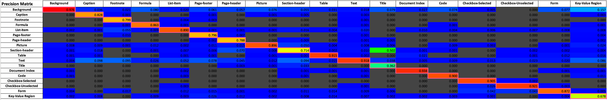
  <dialog class="lb" onclick="this.close()"></dialog>
</figure>


## 5. Reduced Matrices

As we saw in the previous section the Confusion, Recall and Precision matrices are an invaluable source of information for the performance of a classifier.
At the same time, this information can be overwhelming. In Heron's case, it means analyzing three matrices (confusion, recall, precision), each of dimension `18x18`.
One way to condense this information is to sum the cell values of all "non-background" classes into one class.
This way we produce reduced `2x2` matrices for the "Background" class and the "non-Background" super-class.
This abstraction allows us to quickly check if the classifier can detect the elements of the page correctly, regardless of the type of document element.

For Heron, Figure 6 shows the reduced Recall and Precision matrices:


<figure>
  <figcaption style="font-size: 1.1em; font-weight: 600; font-style: italic; margin-bottom: 0.5em;"><em>Figure 6. Reduced Recall & Precision Matrices of Heron model on the DocLayNet v2 dataset</em></figcaption>
  
  <dialog class="lb" onclick="this.close()"></dialog>
</figure>


<a id="6-dual-taxonomies-confusion-matrix"></a>
## 6. Dual Taxonomies Confusion Matrix

So far we have constructed confusion matrices where both the ground truth (rows) and the model predictions (columns) use the same classes.
However, very often we need to compare model predictions against datasets or other models that use different class taxonomies.
Assuming that the ground truth uses the classes `BG, GT1, ..., GTn` and a model uses the classes `BG, P1, ... , Pm`,
we can create a confusion matrix on top of the union-taxonomy with the classes `BG, GT1, ..., GTn, P1, ... Pm`.

This extended matrix will be sparse and have the block structure shown in Figure 7 where the non-zero values are:
- First column (Background) for the rows: `[BG, GT1, ..., GTn]`
- Top left block, for the rows `[BG, GT1, ..., GTn]` and columns: `[BG, P1, ..., Pm]`.

All other values are zero as the model never predicts on the ground truth taxonomy and the evaluation is never done against the model's taxonomy.

<figure>
  <figcaption style="font-size: 1.1em; font-weight: 600; font-style: italic; margin-bottom: 0.5em;"><em>Figure 7. Dual class taxonomies matrices</em></figcaption>
  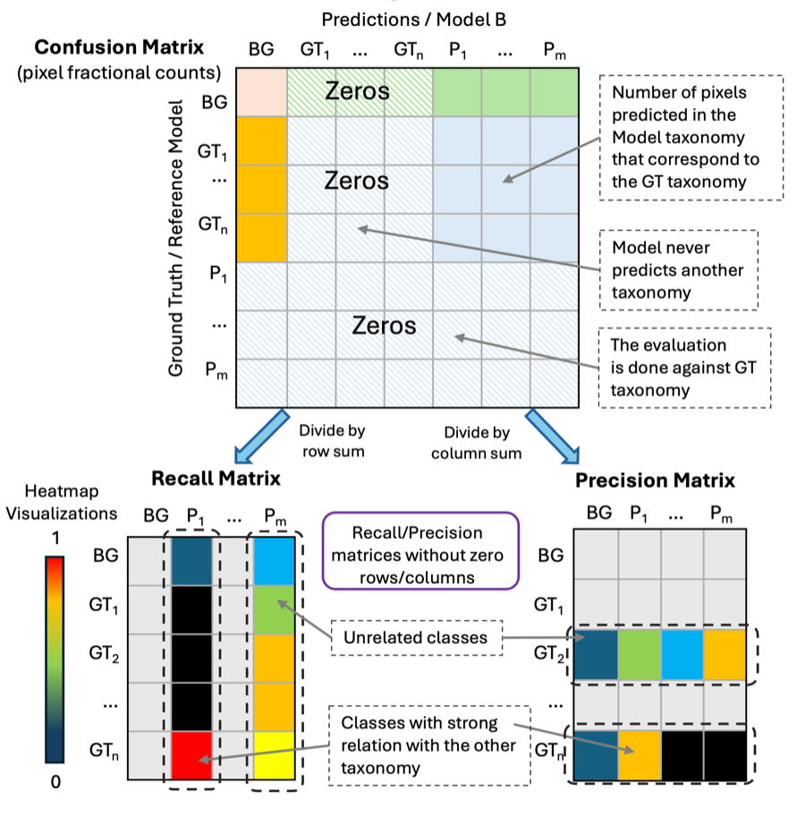
  <dialog class="lb" onclick="this.close()"></dialog>
</figure>

As shown in Figure 7 we can derive Recall and Precision matrices by dividing each value by its row/column sum.
Notice that the classic recall and precision vectors per class can no longer be computed,
as the diagonals of the recall and precision matrices are no longer meaningful.

What can be extracted, however, is highly informative.
From the **Recall matrix**, one can start from a prediction class (column) and trace which ground truth classes (rows) it maps to most strongly — revealing the semantic relationship between the two vocabularies.
From the **Precision matrix**, one starts from a ground truth class (row) and identifies which prediction classes correspond to it.
In practice this allows a researcher to see, for instance, that prediction class `P1` is strongly related to ground truth class `GTn`, or that prediction class `Pm` cannot be easily mapped to any ground truth class at all.

Additionally, similarly to what happens with the same class taxonomy matrices, it is possible to reduce the matrix by collapsing all non-background classes into one class.

Figure 8 shows the full picture for the same class taxonomy and dual class taxonomies confusion matrices and their derivatives.

<figure>
  <figcaption style="font-size: 1.1em; font-weight: 600; font-style: italic; margin-bottom: 0.5em;"><em>Figure 8. Multiple class taxonomies matrices (read the diagram in the indicated order)</em></figcaption>
  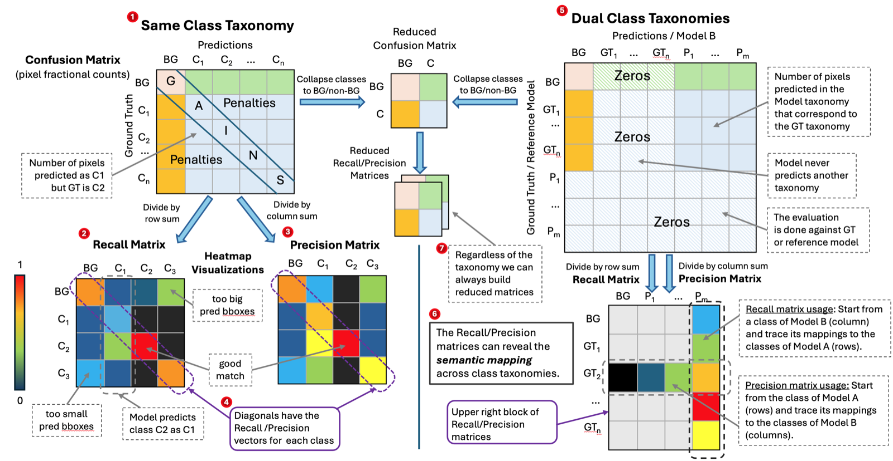
  <dialog class="lb" onclick="this.close()"></dialog>
</figure>


## 7. Example 2: TORE with Dual Taxonomies

In this example we want to demonstrate how TORE can be used to compare models with different class taxonomies.
We will use "Heron" ([2][2]) as the reference and compare it to "nemotron-page-elements-v3" ([7][7]).
The "nemotron-page-elements-v3" model uses the following class taxonomy:

```python
["table", "chart", "title", "infographic", "text", "header_footer"]
```

The input pages are taken from the test split of the "ViDoRe V3" dataset ([6][6]).
Notice that in this example we do not compare the models against any ground truth, but against each other.
We have selected "Heron" as the reference and "nemotron-page-elements-v3" as the measured model, but it could be the other way around.

In Figure 9 we illustrate the full dual-taxonomy Confusion Matrix (click on the Figure to zoom in).
The matrix has the expected block shape as described in [Section 6](#6-dual-taxonomies-confusion-matrix), with the following all-zero regions:

- The columns corresponding to the classes of the reference model ("Heron"). This happens because the measured model ("nemotron-page-elements-v3") is never going to predict such classes.
- The rows corresponding to the classes of the measured model ("nemotron-page-elements-v3"). This happens because the evaluation is done only for the classes of the reference model.

<figure>
  <figcaption style="font-size: 1.1em; font-weight: 600; font-style: italic; margin-bottom: 0.5em;"><em>Figure 9. The full Confusion Matrix of Heron vs nemotron-page-elements-v3 over the ViDoRe V3 dataset</em></figcaption>
  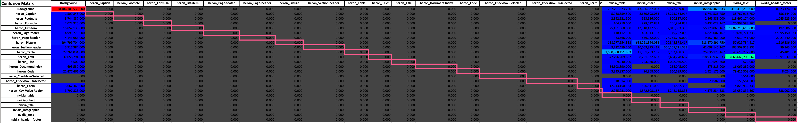
  <dialog class="lb" onclick="this.close()"></dialog>
</figure>

In order to improve the readability, we have redrawn the confusion matrix while hiding the all-zeros rows and columns in Figure 10.
This allows to focus on the non-zero elements and make some semantic comparison across the predictions of the two models.

<figure>
  <figcaption style="font-size: 1.1em; font-weight: 600; font-style: italic; margin-bottom: 0.5em;"><em>Figure 10. The Confusion Matrix of Heron vs nemotron-page-elements-v3 without the zero rows/columns</em></figcaption>
  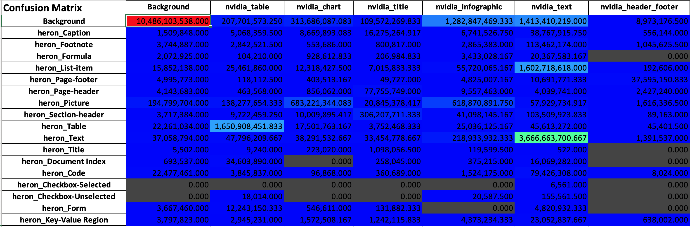
  <dialog class="lb" onclick="this.close()"></dialog>
</figure>

Similarly we provide illustrations while hiding the all-zero rows/columns of the Recall and Precision matrices in Figures 11 and 12 respectively.

<figure>
  <figcaption style="font-size: 1.1em; font-weight: 600; font-style: italic; margin-bottom: 0.5em;"><em>Figure 11. The Recall Matrix of Heron vs nemotron-page-elements-v3 over ViDoRe V3</em></figcaption>
  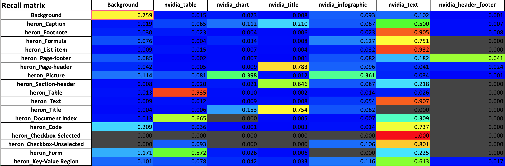
  <dialog class="lb" onclick="this.close()"></dialog>
</figure>


<figure>
  <figcaption style="font-size: 1.1em; font-weight: 600; font-style: italic; margin-bottom: 0.5em;"><em>Figure 12. The Precision Matrix of Heron vs nemotron-page-elements-v3 over ViDoRe V3</em></figcaption>
  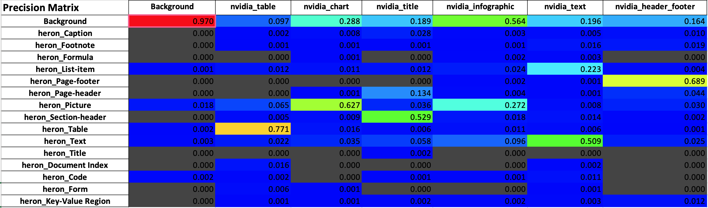
  <dialog class="lb" onclick="this.close()"></dialog>
</figure>

We can use the Recall and Precision matrices to gain insight into how the two models' predictions compare.
Additionally, the visualizations shown in Figures 13 - 16 can help to see in practice the differences in the behavior of the two models.
All pages are taken from the [ViDoReV3][6] dataset and the actual document id and page number are shown in the caption.
On the left side are the predictions of Nvidia's "nemotron-page-elements-v3" and on the right side is "Heron".

First we can examine the Recall matrix column-by-column for all classes of "nemotron-page-elements-v3":

- The `nvidia_table` class maps mainly to the `heron_Table` class.
This is expected as both classes describe the same document item (table) and demonstrates how TORE can reveal semantic connections between classes from different taxonomies.
The example in Figure 13 shows such a case.
However the Recall matrix reveals also some mappings of the `nvidia_table` class to `heron_Document Index` and `heron_Form`.
This is most likely because "Document Indices" and "Forms" look similar to a "Table".

- The `nvidia_chart` and `nvidia_infographic` classes map mainly to `heron_Picture`.
This most likely happens because "Heron" has no "chart" or "infographic" classes, so its "Picture" class is semantically the closest to Nemotron's "chart" and "infographic".
The example in Figure 16 demonstrates this case.

- The `nvidia_title` class maps to `heron_page_header`, `heron_Section-header` and `heron_Title`.
These 3 Heron classes essentially refer to title-like document elements, so it is no surprise that TORE connects them to the `nvidia_title` class.
All examples in Figures 13-16 demonstrate such cases.

- The `nvidia_text` class is spread over multiple classes of Heron.
This happens because Heron has a more fine-grained taxonomy where different types of text-like document elements are mapped into specialized classes (e.g. `List-item`, `Checkbox-Selected`, `Footnote`, etc.).
As Nemotron's taxonomy lacks such specialized text classes the model overuses its `text` class.
Figure 15 demonstrates a characteristic case where a list is classified as "text" by Nemotron and "List-Item" by Heron.

- The `nvidia_header_footer` class maps mainly to `heron_Page-footer`, as was expected.
The example in Figure 15 shows how both models correctly identified the page footer using their corresponding classes.

Examining the Precision matrix, we can see that the `Background` row has a non-negligible mapping to columns other than the `Background`.
This indicates that "nemotron-page-elements-v3" tends to produce larger bounding boxes, in comparison to "Heron", that extend over the actual document element and cover much of the page background.
The example in Figure 16 shows how a single `Infographic` box covers the entire page.


<!-- Page visualisations of the predictions of the 2 models -->
<figure>
  <figcaption style="font-size: 1.1em; font-weight: 600; font-style: italic; margin-bottom: 0.5em;"><em>Figure 13. Nemotron vs Heron: Example1 (doc_id=viz_AFD-100607-009, page_no=22)</em></figcaption>
  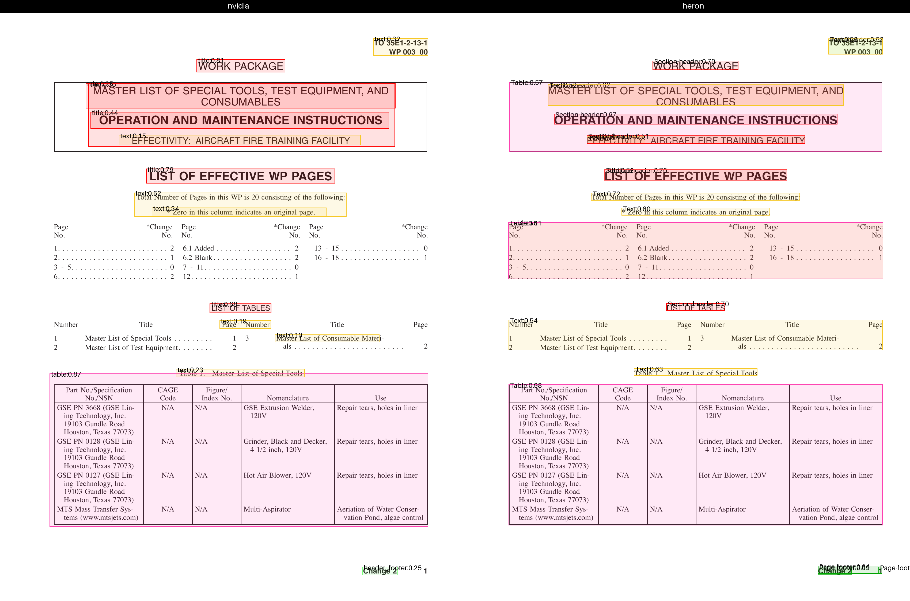
  <dialog class="lb" onclick="this.close()"></dialog>
</figure>

<figure>
  <figcaption style="font-size: 1.1em; font-weight: 600; font-style: italic; margin-bottom: 0.5em;"><em>Figure 14. Nemotron vs Heron: Example2 (doc_id=viz_hermes_2023, page_no=320)</em></figcaption>
  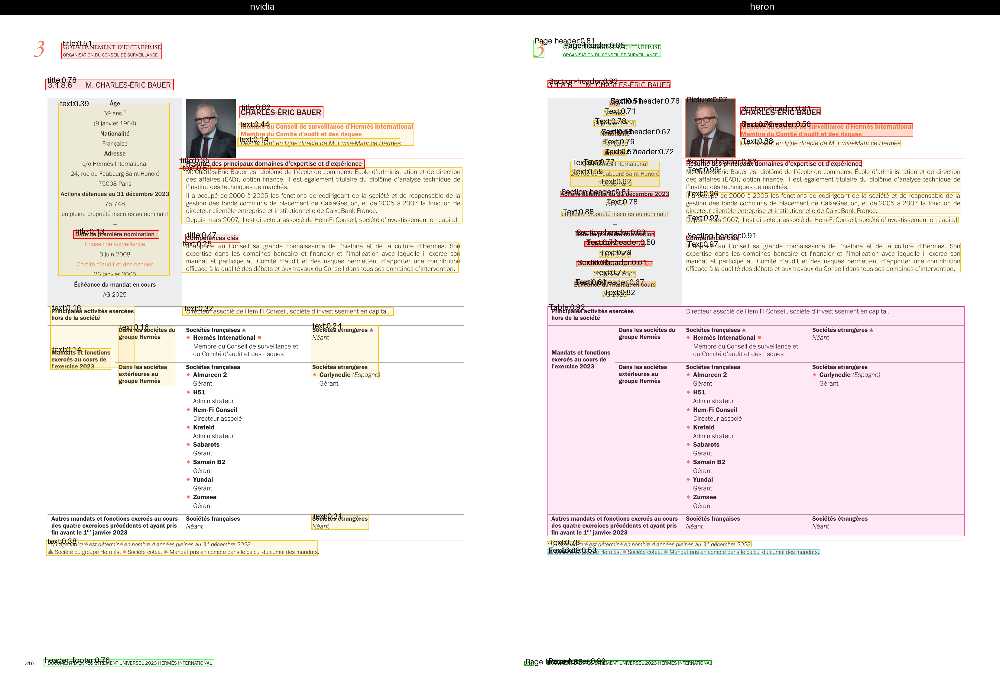
  <dialog class="lb" onclick="this.close()"></dialog>
</figure>

<figure>
  <figcaption style="font-size: 1.1em; font-weight: 600; font-style: italic; margin-bottom: 0.5em;"><em>Figure 15. Nemotron vs Heron: Example 3 (doc_id=viz_hermes_2023, page_no=269)</em></figcaption>
  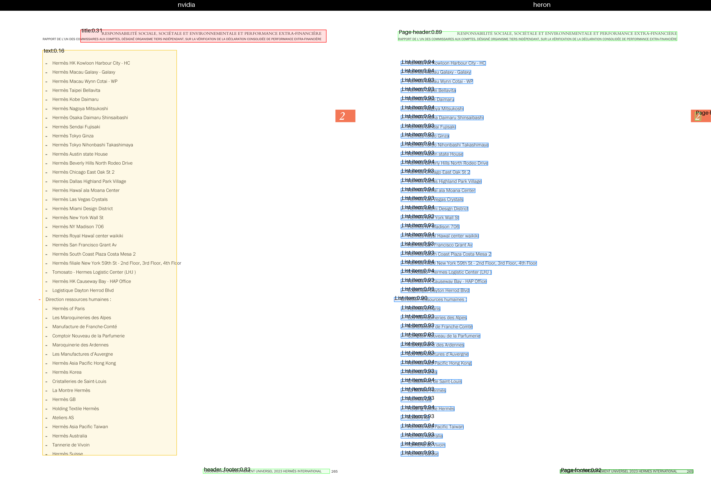
  <dialog class="lb" onclick="this.close()"></dialog>
</figure>

<figure>
  <figcaption style="font-size: 1.1em; font-weight: 600; font-style: italic; margin-bottom: 0.5em;"><em>Figure 16. Nemotron vs Heron: Example 4 (doc_id=viz_State_of_CDER_FDLI2021_PCavazzoni_20210515, page_no=4)</em></figcaption>
  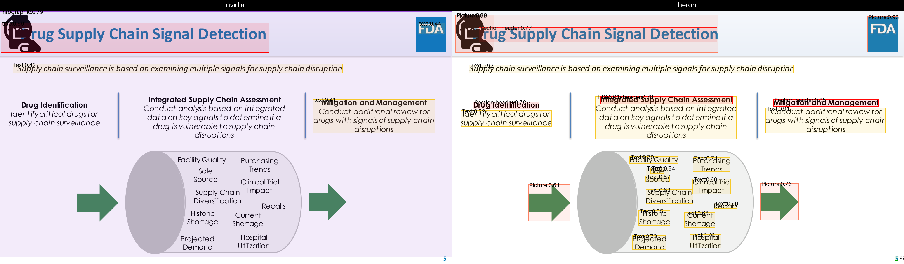
  <dialog class="lb" onclick="this.close()"></dialog>
</figure>


## 8. Implementation Optimizations

As already mentioned, the first step in TORE is to project the document layout resolution on the image pixels.
This process happens both for the reference resolutions and the predictions.
In the TORE implementation we bit-pack up to 64 labels per pixel inside an unsigned 64-bit integer (`uint64`).
In our encoding we allocate the `index-0` to the `BG` class and support up to 63 additional labels per pixel,
which provides enough space for overlapping bounding boxes.
This dense representation enables an efficient implementation of the [TORE algorithm](#3-building-the-confusion-matrix),
which computes multiple pixels in parallel using SIMD operations.

Figure 17 provides an example of the binary representation for the pixel labels used in TORE.

After rasterization, a compression step further reduces the computational cost.
Instead of processing every pixel independently, the implementation counts the number of distinct pixel-pairs `[reference, prediction]` that appear on the page.
The contribution matrix of each unique pair is computed only once and then multiplied by the number of times this pair appears.
Because the number of unique pixel-pairs is substantially smaller than the total pixel count, this dramatically reduces the computational overhead.
Finally we parallelize the computation of the page-level confusion matrices.

<figure>
  <figcaption style="font-size: 1.1em; font-weight: 600; font-style: italic; margin-bottom: 0.5em;"><em>Figure 17. Example of TORE binary representation using uint4 (TORE implementation uses uint64). The bboxes with dashed lines correspond to the reference resolution (e.g. ground-truth) and the solid ones to the predictions.</em></figcaption>
  
  <dialog class="lb" onclick="this.close()"></dialog>
</figure>


## 9. Summary

In this article we presented the "Taxonomy-invariant Object Recognition Evaluation" (TORE) metric and explained why it is well suited to evaluate the layout analysis of documents.
We showed that the mean Average-Precision metric suffers from many limitations that make it unsuitable and even nonsensical when a model does not produce confidence scores.
TORE overcomes these limitations and provides insight into a model's performance through standard mathematical tools such as the confusion matrix and its derivatives.
One of TORE's major strengths is its ability to evaluate across heterogeneous classification taxonomies.
This allows a model to be evaluated on a dataset that uses different classes, as well as direct model-to-model comparisons regardless of the underlying taxonomies.
Via concrete examples we showcased how to use the confusion, recall and precision matrices and understand where the predictions of two models match and where they differ.
Lastly we showed an efficient TORE implementation that accelerates the runtime performance of the metric via SIMD operations and parallelism.


## 10. References

<!-- References with the text only in the visible link -->
- [\[1\] Advanced Layout Analysis Models for Docling][1]
- [\[2\] Heron for Docling on Hugging Face][2]
- [\[3\] Multi-Label Classifier Performance Evaluation with Confusion Matrix][3]
- [\[4\] One Metric to Measure them All: Localisation Recall Precision (LRP) for Evaluating Visual Detection Tasks][4]
- [\[5\] mAP is wrong if all scores are equal][5]
- [\[6\] ViDoRe V3][6]
- [\[7\] nemotron-page-elements-v3][7]


<!-- References with the text and the URL in the visible link -->
<!--
- [\[1\] "Advanced Layout Analysis Models for Docling"][1] — [https://arxiv.org/abs/2509.11720][1]
- [\[2\] "Heron for Docling on Hugging Face"][2] — [https://huggingface.co/docling-project/docling-layout-heron][2]
- [\[3\] "Multi-Label Classifier Performance Evaluation with Confusion Matrix"][3] — [https://csitcp.org/paper/10/108csit01.pdf][3]
- [\[4\] "One Metric to Measure them All: Localisation Recall Precision (LRP) for Evaluating Visual Detection Tasks"][4] — [https://arxiv.org/abs/2011.10772][4]
- [\[5\] "mAP is wrong if all scores are equal"][5] — [https://github.com/cocodataset/cocoapi/issues/678][5]
- [\[6\] "ViDoRe V3"][6] — [https://huggingface.co/collections/vidore/vidore-benchmark-v3][6]
- [\[7\] "nemotron-page-elements-v3"][7] — [https://huggingface.co/nvidia/nemotron-page-elements-v3][7]
-->


<!-- DO NOT DELETE IT: Invisible ground truth of references with URLs-->
[1]: https://arxiv.org/abs/2509.11720
[2]: https://huggingface.co/docling-project/docling-layout-heron
[3]: https://csitcp.org/paper/10/108csit01.pdf
[4]: https://arxiv.org/abs/2011.10772
[5]: https://github.com/cocodataset/cocoapi/issues/678
[6]: https://huggingface.co/collections/vidore/vidore-benchmark-v3
[7]: https://huggingface.co/nvidia/nemotron-page-elements-v3

