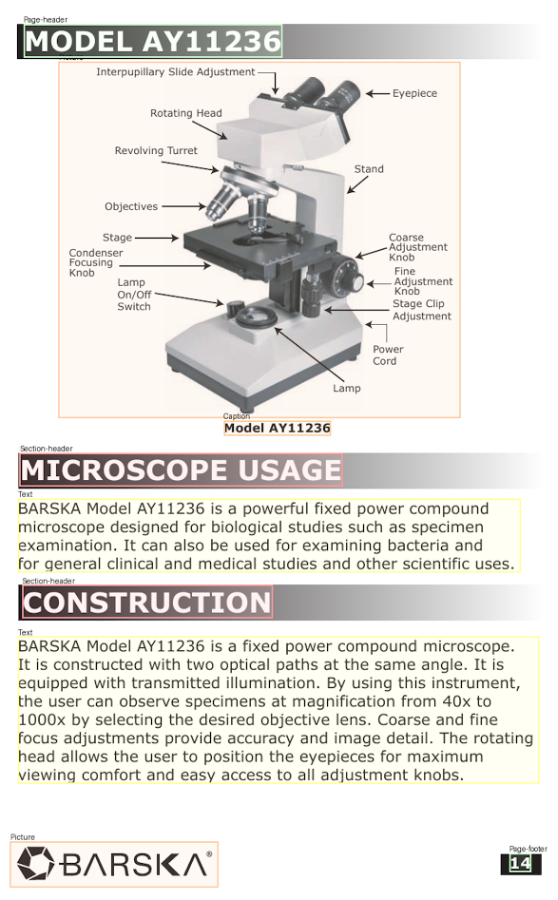

May 5, 2026

The document layout analysis task consists of detecting the class of the various document elements alongside their location on the page. This tasks presumes a taxonomy for the document elements like: `Page header`, `Text`, `Picture`, `Caption`, etc.

*Figure 1. Document layout analysis example.*

