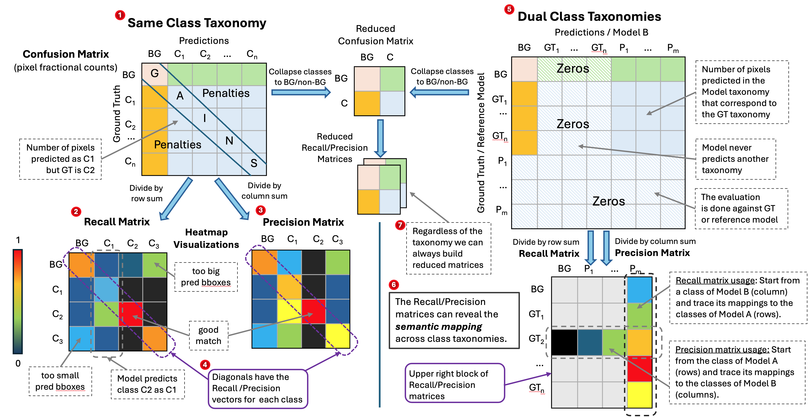
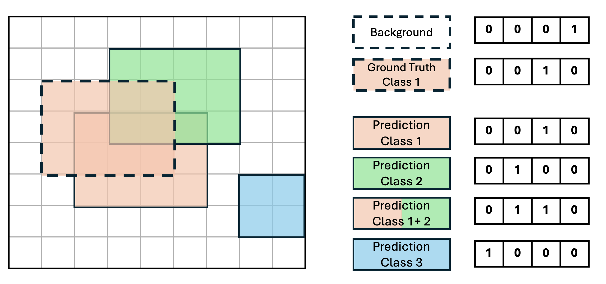

Document layout analysis — the task of locating and classifying elements such as titles, tables, figures, and text blocks within a page — is a cornerstone of modern document AI pipelines.
Yet evaluating how well a model performs this task turns out to be surprisingly tricky.
Three fundamental difficulties stand out immediately:

- The most widely used metric, mean Average Precision (mAP), is known to have many limitations which makes mAP inappropriate for the evaluation of document layout analysis.
- Most evaluation methods are applicable only between layout resolutions that use the same class taxonomy. This leaves outside cases like:
  - Evaluate a model on an annotated dataset that uses a different class taxonomy.
  - Use a non-annotated dataset to evaluate two models against each other, and each model uses its own class taxonomy.
- How to accelerate the computation of the metric on the CPU using SIMD operations.

In this article we will present the **"Taxonomy-invariant Object Recognition Evaluation (TORE)"** method which allows to overcome all above limitations.

In a typical TORE workflow the following steps take place:
- Generate rasterizations of the reference and predicted layout resolutions (bounding boxes + labels).
  - Each resolution is projected on top of the input image.
  - Each rasterized pixel is assigned one or more labels.
  - Assign the special class "Background" to the pixels without any annotation/detection.
  - The reference resolution can be either ground-truth annotations or the detections of a "reference" model.
- Convert the rasterized layout resolutions into a compressed binary format.
  - Each pixel is represented by a `uint64` number.
  - Only unique combinations of `(reference, predicted)` pixel pairs take part in the computation.
- Compute the Confusion Matrix and its derivatives Recall Matrix and Precision Matrix.
- Reduce the matrices to their `2x2` variants by collapsing the non-background classes together.

In the next sections we provide more insight.


## 1. Evaluation Challenges in Layout Analysis

As it has already been observed (see [[1]](https://arxiv.org/abs/2509.11720), [[2]](https://arxiv.org/abs/2011.10772), [[4]](https://github.com/cocodataset/cocoapi/issues/678)) mean Average Precision suffers from several notable limitations.
Most critically, mAP becomes meaningless when predictions lack confidence scores. Without a ranking mechanism, the Precision-Recall curve degenerates into a single point, rendering Average Precision nonsensical.
However many models provide predictions without confidence scores.
Beyond this, mAP treats all predictions that meet the minimum IoU threshold as equally valid, regardless of how precisely they overlap with the ground truth.
Implementation details such as PR curve interpolation, area computation methods, and caps on the number of predictions per image have also been shown to affect the evaluation results.
Finally, mAP offers no diagnostic value: it provides no insight into which classes a model excels at or struggles with — information that would be invaluable during model development.

A qualitative study of layout analysis in real-world documents reveals that the high complexity of documents often yield ambiguous annotations.
As shown in Figure 1 it is not clear if the ground truth data (left side) or the model predictions (right side) are correct or maybe both are valid layout resolutions.
In the example the main body of the page has been annotated as one big `Picture`, but the model predicts a more detailed classification where textual elements have been identified as `Section-Header`, `Text` and `List Item` and the bounding boxes of the pictures have been reduced to cover only the visual content.


<!--  -->
*Figure 1. Ambiguous document layout analysis predictions.*


## 2. Single taxonomy Confusion Matrix and its derivatives

A confusion matrix is a tabular representation of a classifier’s predictions, where each row corresponds to a ground-truth class and each column to a predicted class.
The element `c[i,j]` denotes the number of pixels belonging to class `i` that were predicted as class `j`.
For a perfect classifier, the confusion matrix is purely diagonal.
In real-life classifications, the diagonal entries quantify correct predictions and count as "Gains",
while the off-diagonal entries correspond to mis-predictions and count as "Penalties".

In Figure 4 we can see a Confusion Matrix built for the classes `C1, C2, ... , Cn` and the special "Background" class `BG`.


*Figure 4. The Confusion Matrix quantifies the strengths and weaknesses of the predictions both globally and on a per-class basis*

Several performance measurements can derive out of the confusion matrix:

- **Recall matrix (row-wise normalized confusion matrix):** Provides a class-wise overview of recall. It shows how accurately each class is predicted and highlights systematic confusions, e.g., “class (X) is misclassified as class (Y) with this frequency”.
- **Precision matrix (column-wise normalized confusion matrix):** Provides a class-wise overview of precision by showing how reliable the predictions of each class are.
- **Recall and precision vectors:** Contain the exact recall and precision values for each class individually.

Finally, the confusion matrix and its derived recall and precision matrices can be visualized effectively using heatmaps, enabling intuitive inspection of prediction patterns and systematic errors.


## 3. Building a multi-class, multi-label Confusion Matrix

Document layout analysis is a multi-class and multi-label task as it involves multiple classes and the prediction can assign multiple labels at the same pixel due to bounding box overlaps.
We can compute the confusion matrix per page by applying the approach of [[2]](https://csitcp.org/paper/10/108csit01.pdf) for each pixel.
The main idea of [[2]](https://csitcp.org/paper/10/108csit01.pdf) is the _"Algorithm 1"_ listed on page 9, which distinguishes 4 cases and assigns fractional _"Gains"_ and _"Penalties"_ for each sample of the dataset.
These 4 cases are:

- Case 1: The prediction has assigned to the sample the same label as in ground-truth (perfect match).
- Case 2: The prediction has assigned to the sample the label of the ground-truth plus some additional wrong label(s) (over-prediction).
- Case 3: The prediction has assigned to the sample only a subset of the ground-truth labels (under-prediction).
- Case 4: Predicted and ground-truth labels have some partial overlap and some diff (diff-prediction).

The "TORE" algorithm is an application of "Algorithm 1" for the use case where the samples are image pixels.
Additionally in TORE we omit the case 3, as the ground-truth has single-label annotations.
First we compute the confusion matrix for all pixels of a page and then we sum up to produce the dataset-level confusion matrix.


## 4. Example 1: Apply TORE on the "Heron" model

In the next example we will show how the confusion, recall and precision matrices look like when we apply the TORE metric on the "Heron" model for document layout analysis
([[1] "Advanced Layout Analysis Models for Docling"](https://arxiv.org/abs/2509.11720), [[5] "Heron - Docling"](https://huggingface.co/docling-project/docling-layout-heron))

The "Heron" model uses a taxonomy of 17 classes:

```python
[
    "Caption",
    "Footnote",
    "Formula",
    "List-item",
    "Page-footer",
    "Page-header",
    "Picture",
    "Section-header",
    "Table",
    "Text",
    "Title",
    "Document Index",
    "Code",
    "Checkbox-Selected",
    "Checkbox-Unselected",
    "Form",
    "Key-Value Region",
]
```
Additionally, the class `"Background"` has been added as the first row/column.

Figure 5 shows the "Confusion Matrix" of the model against the DocLayNet-v2 dataset which uses the same class taxonomy.
The rows correspond to the ground-truth, the columns to the predictions and each `cell(i,j)` shows the number of pixels that belong to `class-i` but have been predicted as `class-j`.
Notice that the pixel counts are fractional due the way the algorithm distributes "gains" and "penalties" for each predicted label.
We use a color code to indicate the magnitude of the cell counts and highlight the main diagonal with pink.


*Figure 5. The Confusion Matrix of Heron model on the DocLayNet v2 dataset*

If we normalize the confusion matrix row-wise (divide each cell with the sum of its row), we get the "Recall Matrix", as shown in Figure 6.
Given that an ideal recall matrix has values only on the main diagonal, the perfect predictor should have red cells on the diagonal and black elsewhere.

As we can see in the example of "Heron" the recall matrix provides invaluable insight on the performance of the model.
We can see immediately for which classes the model performs well or bad and in case of mis-classifications which classes are confusing the model.
For example we can see that "Heron" performs excellent for "Background" and quite well for the classes: "Picture", "Table", "Text", "Document Index", "Code" and "Form".
The recall for "Checkbox-Selected" and "Checkbox-Unselected" is still high but a bit lower.
The model lacks recall mostly for the classes "Key-Value Region", and "Title".
Also the recall reveals that "Heron" tends to mis-classify "Title" as "Section-Header".

If we extract the main diagonal elements we get the _Recall Vector_.


*Figure 6. The Recall Matrix of Heron model on the DocLayNet v2 dataset*

The Precision Matrix is the normalisation of the confusion matrix column-wise (divide each cell with the sum of its column).
This is shown in Figure 7.
The precision matrix can also help to derive interesting conclusions for the performance of a model.
For example we see high off-diagonal value for the cell `["Background", "Key-Value Region"]`, which indicates that Heron misses key-value bounding boxes and mis-classifies them as "Background".


*Figure 7. The Precision Matrix of Heron model on the DocLayNet v2 dataset*


## 5. Reduced matrices

As we saw in the previous section the Confusion, Recall and Precision matrices are an invaluable source of information for the performance of a classifier.
At the same time this information can be intimidating. In case of Heron it means to analyze the information of 3 matrices (confusion, recall, precision) with dimensions `18x18`.
One way to abstract this information into a reduced form, is to sum up the cell values for all "non-background" classes into one class.
This way we produce reduced `2x2` matrices for the "Background" class and the "non-Background" super-class.
This abstraction allows to quickly check if the classifier can detect the elements of the page correctly, regardless of the type of document element.

In case of Heron, Figure 8 shows the reduced Recall and Precision matrices:


*Figure 8. Reduced Recall & Precision Matrices of Heron model on the DocLayNet v2 dataset*


## 6. Extending to Dual Taxonomies

So far we have constructed confusion matrices where both the ground truth (rows) and the model predictions (columns) use the same classes.
However very often we need to compare model predictions against datasets or other models that use different class taxonomies.
Assuming that the ground truth uses the classes `BG, GT1, ..., GTn` and a model uses the classes `BG, P1, ... , Pm`,
we can create a confusion matrix on top of the union-taxonomy with the classes `BG, GT1, ..., GTn, P1, ... Pm`.

This extended matrix will be sparse and have the block structure shown in Figure 9 where the non-zero values are:
- First column (Background) for the rows: `[BG, GT1, ..., GTn]`
- Top left block, fro the rows `[BG, GT1, ..., GTn]` and columns: `[BG, P1, ..., Pm]`.

All other values are zero as the model never predicts on the ground truth taxonomy and the evaluation is never done against the model's taxonomy.


*Figure 9. Dual class taxonomies matrices*

As shown in Figure 9 we can derive Recall and Precision matrices by dividing each value over its row/column sum.
Notice that the classic recall and precision vectors per class can no longer be computed,
as the diagonal of the recall and precision matrices are no longer meaningful.

What can be extracted, however, is highly informative.
From the **Recall matrix**, one can start from a prediction class (column) and trace which ground truth classes (rows) it maps to most strongly — revealing the semantic relationship between the two vocabularies.
From the **Precision matrix**, one starts from a ground truth class (row) and identifies which prediction classes correspond to it.
In practice this allows a researcher to see, for instance, that prediction class `P1` is strongly related to ground truth class `GTn`, or that prediction class `Pm` cannot be easily mapped to any ground truth class at all.

Additionally, similarly to what happens with the same class taxonomy matrices, it is possible to reduce the matrix but collapsing all non-background classes into one class.

Figure 10 shows the full picture for the same class taxonomy and dual class taxonomies confusion matrices and their derivatives.


*Figure 10. Multiple class taxonomies matrices (read the diagram in the indicated order)*


## 7. Example 2: TORE with dual class taxonomies on "Heron"

TODO


## 8. Implementation Optimisations: Binary Encoding and Parallelism

As already mentioned, the first step in TORE is to project the document layout resolution on the image pixels.
This process happens both for the reference resolutions and the predictions.
In the TORE implementation we bit-pack up to 64 labels per pixel inside an unsigned 64-bit integer (`uint64`).
In our encoding we allocate the `index-0` to the `BG` class and support up to 63 additional labels per pixel,
which provides enough space for overlapping bounding boxes.
This dense representation enables an efficient implementation of the [TORE algorithm](#3.-building-a-multi-class,-multi-label-confusion-matrix),
which computes multiple pixels in parallel using SIMD operations.

Figure 11 provides an example of the binary representation for the pixel labels used in TORE.

After the rasterization, compression step further reduces the computational cost.
Instead of processing every pixel independently, the implementation counts the number of distinct pixel-pairs `[reference, prediction]` that appear on the page.
The contribution matrix of each unique pair should be computed only once and then multiplied by the number of times this pair appears.
Because the number of unique pixel-pairs is substantially smaller than the total pixel count, this dramatically reduces the computational overhead.
Finally we parallelize the computation of the page-level confusion matrices.


*Figure 11. Example of TORE binary representation using uint4 (TORE implementation uses uint64). The bboxes with dashed lines correspond to the reference resolution (e.g. ground-truth) and the solid ones to the predictions.*

## 9. Summary

This pixel-wise evaluation framework addresses the limitations of existing approaches for document layout analysis in a coherent and systematic way.
It handles multi-label predictions arising from overlapping bounding boxes, accounts for background regions, and extends to comparisons across models that operate under different classification taxonomies.
The reduced matrix abstraction provides a common currency for cross-taxonomy comparison, while the bit-packed binary encoding and representation compression keep the runtime low enough to support rapid experimentation.
Together, these properties make it a practical and principled tool for anyone developing or benchmarking document layout models at scale.


## 10. References

- [[1] "Advanced Layout Analysis Models for Docling"](https://arxiv.org/abs/2509.11720)
- [[2] "Multi-Label Classifier Performance Evaluation with Confusion Matrix"](https://csitcp.org/paper/10/108csit01.pdf)
- [[3] "One Metric to Measure them All: Localisation Recall Precision (LRP) for Evaluating Visual Detection Tasks"](https://arxiv.org/abs/2011.10772)
- [[4] "mAP is wrong if all scores are equal](https://github.com/cocodataset/cocoapi/issues/678)
- [[5] "Heron for Docling on Hugging Face"](https://huggingface.co/docling-project/docling-layout-heron)


<!-- - [[4] "MinerU2.5: A Decoupled Vision-Language Model for Efficient High-Resolution Document Parsing"](https://arxiv.org/abs/2509.22186)  -->

