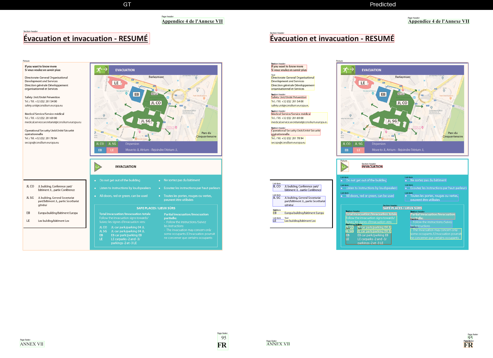
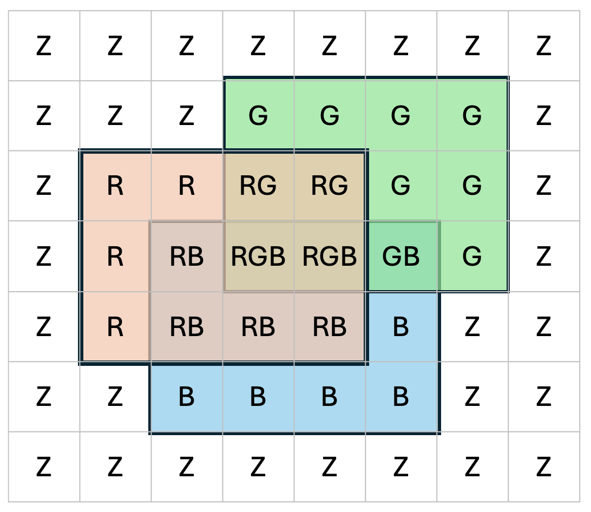
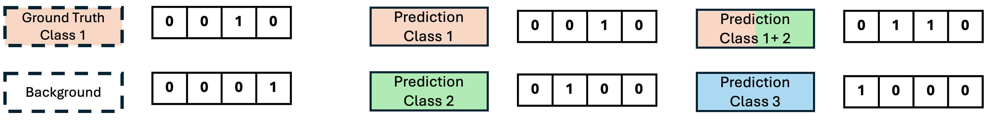

Document layout analysis — the task of locating and classifying elements such as titles, tables, figures, and text blocks within a page — is a cornerstone of modern document AI pipelines. Yet evaluating how well a model performs this task turns out to be surprisingly tricky. Two fundamental difficulties stand out immediately:

- By definition each model uses its own taxonomoy of classes, making it very hard to perform cross-taxonomy evaluations.
- The most widely used metric, mean Average Precision (mAP), is known to have many limitations and cannot be applied in a meaningful way when the predictions lack confidence scores.

In this article we will present the "Taxonomy-invariant Object Recognition Evaluation (TORE)" method which allows to:

- Compute a multi-label confusion matrix that provides insights about the recall and precision for each individual class. This can be computed regardless of the existence of confidence scores.
- Allows evaluations across class taxonomies.
- Can be implemented efficiently using SIMD operations.

## 1. Evaluation Challenges in Layout Analysis

As it has already been observed (see [[1]](https://arxiv.org/abs/2509.11720), [[2]](https://arxiv.org/abs/2011.10772), [[4]](https://github.com/cocodataset/cocoapi/issues/678)) mean Average Precision suffers from several notable limitations.
Most critically, mAP becomes meaningless when predictions lack confidence scores. Without a ranking mechanism, the Precision-Recall curve degenerates into a single point, rendering Average Precision nonsensical.
However many models provide predictions without confidence scores.
Beyond this, mAP treats all predictions that meet the minimum IoU threshold as equally valid, regardless of how precisely they overlap with the ground truth.
Implementation details such as PR curve interpolation, area computation methods, and caps on the number of predictions per image have also been shown to affect the evaluation results.
Finally, mAP offers no diagnostic value: it provides no insight into which classes a model excels at or struggles with — information that would be invaluable during model development.

A qualitative study of layout analysis in real-world documents reveals that the high complexity of documents often yield ambiguous annotations.
As shown in Figure1 it is not clear if the ground truth data (left side) or the model predictions (right side) are correct or maybe both are valid layout resolutions.
In the example the main body of the page has been annotated as one big `Picture`, but the model predicts a more detailed classification where textual elements have been identified as `Section-Header`, `Text` and `List Item` and the bounding boxes of the pictures have been reduced to cover only the visual content.

<!--  -->
*Figure 1. Ambiguous document layout analysis predictions.*

## 2. Pixel-wise Layout Resolution and binary representation

The first step in TORE is to project the document layout resolution on the image pixels.
This process happens both for the ground truth annotations and the predictions.
The taxonomy classes and the special "background" class are flags set for each image pixel.
The ground truth pixels have only one class (or the "background").
The prediction pixels can have multiple classes as the model may produce overlapping bounding boxes.

*Figure 2. Pixel-wise layout resolution for the classes R, G, B. The background class Z has been added for the pixels without class resolution.*

The next step is to bit-pack the classes of each pixel, generating a dense binary representation.
Using `uint64` numbers we can encode 63 classes and the Background.
The background is the index 0 and each class is represented by the indices 1 - 63.

*Figure 3. Bit-packing allows to encode the multiple classes in a single integer per pixel*

## 3. Building the Confusion Matrix for a Single Taxonomy

A confusion matrix is a tabular representation of a classifier’s predictions, where each row corresponds to a ground-truth class and each column to a predicted class.
The element (C_{ij}) denotes the number of pixels belonging to class (i) that were predicted as class (j).
For a perfect classifier, the confusion matrix is purely diagonal.
In real-life classifications, the diagonal entries quantify correct predictions and count as "gains", while the off-diagonal entries correspond to mispredictions and count as "penalties".

Several performance measurements can derive out of the confusion matrix:

- **Recall matrix (row-wise normalized confusion matrix):** Provides a class-wise overview of recall. It shows how accurately each class is predicted and highlights systematic confusions, e.g., “class (X) is misclassified as class (Y) with this frequency”.
- **Precision matrix (column-wise normalized confusion matrix):** Provides a class-wise overview of precision by showing how reliable the predictions of each class are.
- **Recall and precision vectors:** Contain the exact recall and precision values for each class individually.
- **Higher-level abstractions:** The matrix can be aggregated to analyze broader behaviors, such as the magnitude of correct and incorrect predictions between the "Background" class (BG) and all foreground classes combined.

Finally, the confusion matrix and its derived recall and precision matrices can be visualized effectively using heatmaps, enabling intuitive inspection of prediction patterns and systematic errors.

*Figure 4. The Confusion Matrix quantifies the strengths and weaknesses of the predictions both globally and on a per-class basis*

Document layout analysis is a multi-class and multi-label task as it involves multiple classes and the prediction can assign multiple labels at the same pixel due to bounding box overlaps.
We can compute the confusion matrix per page by applying the approach of [[2]](https://csitcp.org/paper/10/108csit01.pdf) for each pixel.
The main idea of [[2]](https://csitcp.org/paper/10/108csit01.pdf) is the "Algorithm1" listed on page 9, which distinguishes 4 cases and assigns fractional "gains" and "penalties" for each "sample" of the dataset.
These 4 cases are:

- Case 1: The prediction has assigned to the sample the same label as in ground-truth (perfect match).
- Case 2: The prediction has assigned to the sample the label of the ground-truth plus some additional wrong label(s) (over-prediction).
- Case 3: The prediction has assigned to the sample only a subset of the ground-truth labels (under-prediction).
- Case 4: Predicted and ground-truth labels have some partial overlap and some diff (diff-prediction).

In our case each sample is an image pixel.
Also case 3 cannot happen in our case because the ground-truth annotation has at most 1 label.
We get the confusion matrix for a single page by applying "Algorithm1" on the rasterized page.
Lastly the confusion matrix for the entire dataset is the sum of the page-level confusion matrices.

<!-- --------------------------------------------------------------------------------------------------------------------------------------------------------------------------- -->
<!-- The text has been reviewed up to this point -->
<!-- --------------------------------------------------------------------------------------------------------------------------------------------------------------------------- -->

## Extending to Dual Taxonomies

The most novel part of this framework is how it handles the case where the model under evaluation uses a different classification taxonomy from the ground truth (or from a reference model). This scenario is common: two document AI systems trained on different datasets may use different, yet semantically related, label sets.

When two taxonomies are involved, the confusion matrix is extended to cover all classes from both taxonomies simultaneously. The resulting matrix is sparse and has a clear block structure: the rows corresponding to the prediction taxonomy and the columns corresponding to the ground truth taxonomy contain zeros (a model trained on taxonomy B never directly predicts a class from taxonomy A), and vice versa. This means the classic recall and precision vectors per class can no longer be computed — the diagonal is no longer meaningful in isolation.

What can be extracted, however, is highly informative. From the **Recall matrix**, one can start from a prediction class (column) and trace which ground truth classes (rows) it maps to most strongly — revealing the semantic relationship between the two vocabularies. From the **Precision matrix**, one starts from a ground truth class (row) and identifies which prediction classes correspond to it. In practice this allows a researcher to see, for instance, that prediction class P₁ is strongly related to ground truth class GTₙ, or that prediction class Pₘ cannot be easily mapped to any ground truth class at all.

---

## Reduced Matrices: A Common Currency Across Taxonomies

Because recall and precision vectors cannot be defined when two taxonomies differ, a further abstraction is needed to consolidate evaluations across settings. The solution is the **reduced matrix**: collapse all non-background classes into a single "non-background" bin by summing the corresponding pixel counts.

The result is always a 2×2 matrix — background versus non-background — regardless of the original taxonomy size or the number of taxonomies involved. This reduction can be applied to the raw confusion matrix as well as to any of its derivative matrices (recall, precision, F1, and so on), and it works identically whether one or two taxonomies are in play. The reduced matrices serve two concrete purposes: they make it possible to evaluate over- and under-sized predicted bounding boxes in a taxonomy-agnostic way, and they provide a consistent basis for comparing results across heterogeneous experimental settings.

---

## Implementation: Binary Encoding and Parallelism

Efficiency is not an afterthought. The framework encodes every pixel's class assignment as a bit-packed integer using `uint64` values, which can represent up to 63 content classes plus the background class (index 0). Each class occupies one bit at positions 1–63, and the background occupies bit 0.

A compression step further reduces the computational cost. Rather than processing every pixel independently, the implementation counts the number of distinct (ground truth, prediction) pixel-pairs that appear on a page. Only the contribution matrix for each unique pair needs to be computed; the page-level confusion matrix is then the weighted sum of these contribution matrices, each multiplied by the number of times its corresponding pixel-pair appears. Because the number of unique pixel-pairs is substantially smaller than the total pixel count, this dramatically reduces the computational overhead. Finally, because each page is entirely independent of the others, page-level matrices can be computed in parallel — something that mAP computation cannot offer.

---

## Summary

This pixel-wise evaluation framework addresses the limitations of existing approaches for document layout analysis in a coherent and systematic way. It handles multi-label predictions arising from overlapping bounding boxes, accounts for background regions even when they are absent from dataset annotations, and — crucially — extends naturally to comparisons across models that operate under different classification taxonomies. The reduced matrix abstraction provides a common currency for cross-taxonomy comparison, while the bit-packed binary encoding and representation compression keep the runtime low enough to support rapid experimentation. Together, these properties make it a practical and principled tool for anyone developing or benchmarking document layout models at scale.

## References

- [[1] "Advanced Layout Analysis Models for Docling"](https://arxiv.org/abs/2509.11720)
- [[2] "Multi-Label Classifier Performance Evaluation with Confusion Matrix"](https://csitcp.org/paper/10/108csit01.pdf)
- [[3] "One Metric to Measure them All: Localisation Recall Precision (LRP) for Evaluating Visual Detection Tasks"](https://arxiv.org/abs/2011.10772)
- [[4] "mAP is wrong if all scores are equal](https://github.com/cocodataset/cocoapi/issues/678)

<!-- - [[4] "MinerU2.5: A Decoupled Vision-Language Model for Efficient High-Resolution Document Parsing"](https://arxiv.org/abs/2509.22186)  -->

