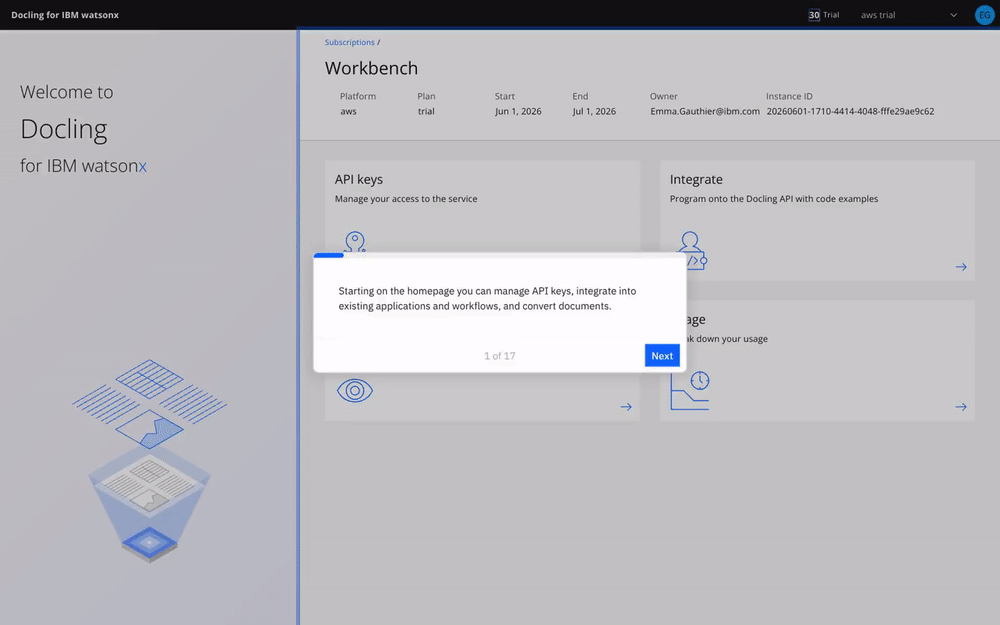

Putting Docling into production has, until now, meant running the
infrastructure yourself: deploy the services, configure the pipeline, plan for
capacity, and keep it all healthy under load. That is very doable, but it is
work that sits between a team and the actual goal of turning documents into
AI-ready data.

**[Docling for IBM watsonx](https://ibm.com/products/docling)** removes that step. It is a managed
Docling-as-a-Service offering that lets teams put Docling into production
without deploying, configuring, and maintaining the underlying infrastructure
themselves. It is designed for a quicker path to value: out-of-the-box
configuration, automatic scaling based on workload demand, and high-throughput
processing without having to plan and manage dedicated capacity.



You can use it through a simple user interface for experimentation, inspection,
and quick document processing. At scale, the same capabilities embed directly
into production applications, automation pipelines, and enterprise AI workflows
through easy-to-use APIs.

The most important thing to say about it, though, is what it means for the
open-source project. So let us start there.

## What this means for Docling as open source

Docling is open source first, and Docling for IBM watsonx does not change that.
The managed service is not a fork and not a proprietary re-implementation. It
runs the same open stack everyone else uses: `docling`, `docling-core`,
`docling-parse`, `docling-jobkit`, and `docling-serve`.

That ordering is the whole point. The work required to run a production-grade,
high-throughput managed service does not disappear into a private branch. It
lands in the open repositories as fixes and features that every Docling user
benefits from. Running Docling at scale is what surfaces the sharp edges, and
across the first half of 2026 you can watch those edges getting filed down,
release after release. The dominant theme of the year so far has not been new
headline features. It has been hardening: stability, memory control, safe
parallelism, and security.

A few concrete examples make the point.

### A thread-safe, memory-bounded parser

The largest single investment has been in `docling-parse`, the C++/Python PDF
engine at the bottom of the stack. Its 2026 releases read almost like a
hardening checklist.

Early in the year the work was about not crashing: replacing fixed-size buffers
with a safer append strategy to prevent segfaults, and robustifying parsing of
broken PDFs. Then it was about not hanging: fixing an infinite loop in
table-of-contents extraction triggered by circular references inside a PDF.
Then it was about doing more at once, safely: making the parser thread-safe by
default, adding a regexp fast path for stream decoding, and shipping
memory-management improvements coordinated with the upstream `docling` library.

That arc culminated in the v6 major release: a public threaded PDF parser with
a worker thread pool and a `max_concurrent_results` cap that explicitly bounds
how many results are buffered in order to limit memory. Results stream out one
at a time, each carrying its own success flag, error message, and timing
information, so a single bad page no longer takes down a whole batch. The same
release upgraded `pillow`, `requests`, `pygments`, and `cryptography` to close
known vulnerabilities, and later updates added a flag to skip bitmap byte
extraction entirely when a caller does not need it, trimming memory further.

This work targets a problem the community knew well. The older v4 parser could
accumulate memory on very long documents, climbing well past 20 GB where other
backends held steady around 4 GB. A bounded-memory, parallel, error-isolating
parser is the proper fix, and it is sitting in the open repository for anyone
to use.

### Hardening all the way up the stack

The parser is not the only place this shows up.

In `docling` itself, 2026 brought a steady stream of reliability fixes across
the backends. PPTX conversion now skips malformed shapes instead of aborting
the whole file. The Markdown backend gained a fix that prevents a
`RecursionError` on certain inputs. The LaTeX handler added path-traversal
prevention, and input validation was strengthened for METS-GBS and USPTO XML
sources. The library adopted the threaded `docling-parse` v6 backend and
introduced a modular `docling-slim` package for a lighter dependency footprint.

In `docling-core`, the focus was data-model integrity: validation to catch
duplicate references, repair of table hierarchies when rich cells break the
structure, and a fix to prevent numeric precision loss when serializing tables
to Markdown.

In `docling-jobkit`, the distributed execution layer, the theme was resilience
against real infrastructure. It can now recover orphaned job status when a
worker pod is killed mid-execution, cap the maximum number of Redis connections
to avoid pool exhaustion, and run a hardened Ray dispatcher with execution
leases and a watchdog that cleans up stuck jobs.

In `docling-serve`, the API service, operational hardening took the lead:
readiness endpoints for clean Kubernetes rollouts, metrics on a separate port,
removal of an expensive forced garbage collection from the status-poll hot
path, control over how much error detail public API responses expose, failing
fast on a bad config file, and server-side page slicing for very long PDFs.

None of this is glamorous, and that is the point. It is exactly the kind of
unglamorous reliability work you want underneath a service you are going to
trust with a production workflow, and all of it is open source.

## Processing data at scale with the batch endpoint

Built on that hardened foundation, one of the most requested capabilities is
now available: a batch endpoint for processing large volumes of documents in a
single job.

Instead of submitting documents one request at a time, you can point Docling at
a source, for example an S3 bucket, and have it process the entire collection
and write the converted results back to a target location. This sits on top of
the `docling-jobkit` orchestration work that landed throughout 2026, so the
same resilience guarantees that protect a single conversion also apply to a
million-page run.

For teams with large document estates, archives, scanned back-catalogs, or
regulatory filings, this turns "convert everything" from a bespoke pipeline you
have to build and babysit into a single managed job.

## The new Docling Service Client

Whether you run your own open-source `docling-serve` deployment or use the
managed SaaS, you can now talk to it through the new Docling Service Client.

Two things make it worth adopting. First, it is ultra lightweight. It installs
without the heavy AI packages, with no `torch`, no model weights, and none of
the inference dependencies. It is just the parts you need to submit work and
collect results, which makes it trivial to drop into an application, a
serverless function, or an automation step without bloating the environment.

Second, it is efficient by design. It handles the submission of conversion
tasks for you, including the polling and waiting loop and efficient batching, so
you are not hand-rolling retry logic and status checks around the API.

The same client works against either backend. You can prototype against a local
`docling-serve`, then point the exact same code at Docling for IBM watsonx when
you are ready to scale, with no rewrite required.

### Installation

The Service Client is available in two ways. If you already have the full
Docling package installed, the client is included and ready to use. If you want
to keep your environment minimal, you can install just the client through the
slim package with the `service-client` extra:

```bash
# option 1) included in the full Docling install
pip install docling

# option 2) slim/modular install with minimal dependencies
pip install "docling-slim[service-client]"
```

### Usage

Here is a simple example showing how to use the Service Client:

```py
from pathlib import Path
from docling.service_client import DoclingServiceClient
import os

# Setup required endpoint details
SERVICE_URL = os.getenv("DOCLING_SERVICE_URL")
API_KEY = os.getenv("DOCLING_API_KEY")

# Initialize the client
with DoclingServiceClient(url=SERVICE_URL, api_key=API_KEY) as client:
    # Convert a document as you usually do
    result = client.convert(
        source=Path("path/to/doc.pdf")
    )
    
    markdown = result.document.export_to_markdown()
    print(markdown)
```

For more examples including batch processing, custom export formats, and advanced
configuration options, see the [Service Client examples](https://github.com/docling-project/docling/tree/main/docs/examples/service_client)
in the Docling repository.

## Getting started with Docling for IBM watsonx

Docling for IBM watsonx is generally available now as a SaaS offering. You can try it for free and start processing documents through an
easy-to-use interface, then move to API-based integration when you are ready to
embed document intelligence into production workflows.

The service is available through the IBM Marketplace or the AWS Marketplace with
a pay-as-you-go pricing.

The result is a practical and cost-effective way to turn complex documents into
reusable, AI-ready data, while reducing the manual effort, cost, and
operational complexity that can slow AI initiatives down.

<div style="display: flex; gap: 1rem; margin-top: 2rem;">
  <a href="https://www.ibm.com/account/reg/us-en/signup?formid=urx-54322&utm_source=docling.ai&utm_medium=referral&utm_campaign=free_trial&utm_content=blog_post" class="button primary" target="_blank">Start a free trial</a>
  <a href="https://www.ibm.com/products/docling" class="button" style="background: transparent; color: var(--accent);" target="_blank">Learn more</a>
</div>

## Recap

A managed service and a healthy open-source project are not in tension here.
Docling for IBM watsonx exists because the open Docling stack is good enough to
run in production, and the open stack is good enough to run in production
because the work of building the managed service flows straight back into it.

If you have been waiting for Docling to feel production-ready, the 2026
hardening releases are the signal. Pull the latest, point the new Service
Client at it, and tell us what you build.

## References

- [Docling repository](https://github.com/docling-project/docling)
- [docling-core](https://github.com/docling-project/docling-core)
- [docling-parse](https://github.com/docling-project/docling-parse)
- [docling-jobkit](https://github.com/docling-project/docling-jobkit)
- [docling-serve](https://github.com/docling-project/docling-serve)
