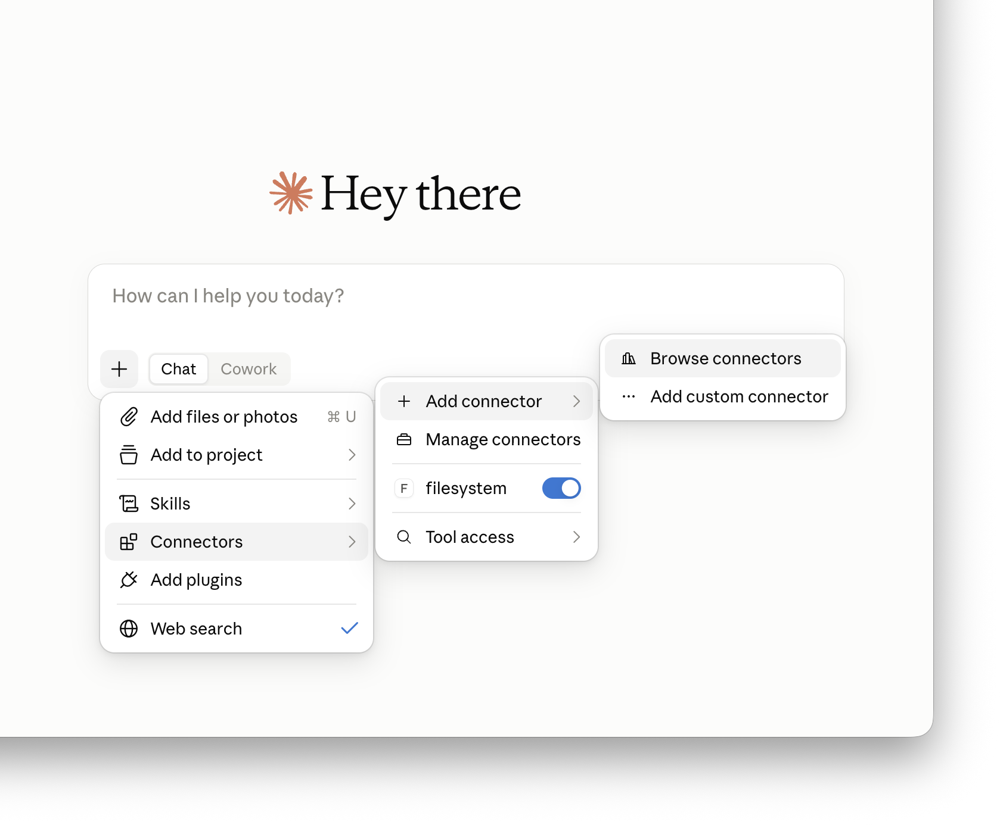
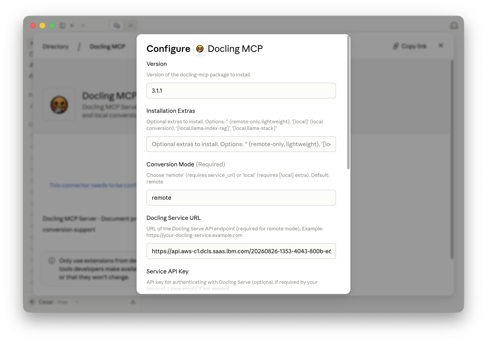
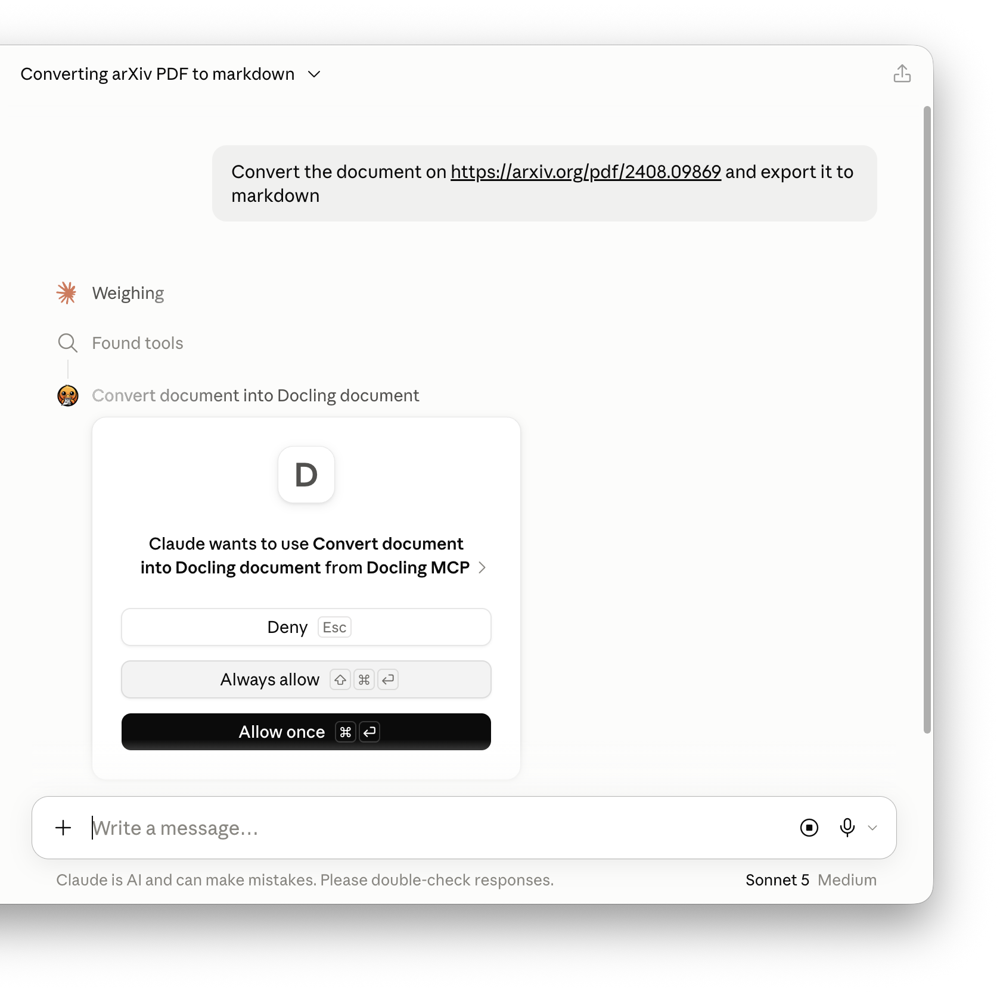
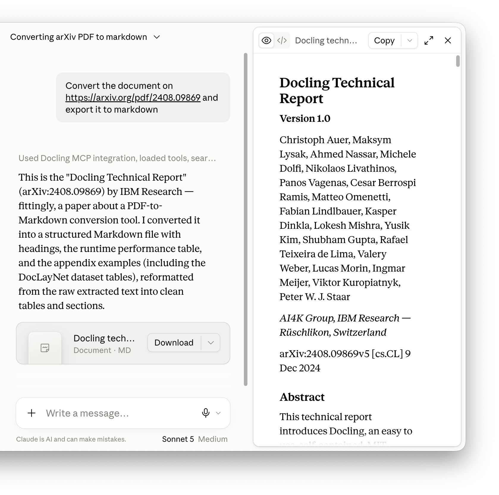

<style>
.claude-carousel { position: relative; overflow: hidden; border-radius: var(--radius); border: 1px solid var(--border); margin: 1.5rem 0; background: var(--bg-card); }
.claude-carousel .cc-track { display: flex; transition: transform 0.35s ease; will-change: transform; }
.claude-carousel .cc-slide { min-width: 100%; }
.claude-carousel .cc-slide img { width: 100%; height: 420px; object-fit: cover; object-position: top; display: block; margin: 0; border: none; border-radius: 0; }
.claude-carousel .cc-btn { position: absolute; top: 50%; transform: translateY(-50%); background: var(--bg-card); border: 1px solid var(--border); color: var(--text-primary); border-radius: 50%; width: 2.25rem; height: 2.25rem; display: flex; align-items: center; justify-content: center; cursor: pointer; z-index: 2; font-size: 1rem; line-height: 1; transition: background var(--dur-fast); }
.claude-carousel .cc-btn:hover { background: var(--bg-card-hover); }
.claude-carousel .cc-prev { left: 0.75rem; }
.claude-carousel .cc-next { right: 0.75rem; }
.claude-carousel .cc-dots { display: flex; justify-content: center; gap: 0.4rem; padding: 0.5rem 0; }
.claude-carousel .cc-dot { width: 6px; height: 6px; border-radius: 50%; background: var(--border-accent); border: none; cursor: pointer; padding: 0; transition: background var(--dur-fast); }
.claude-carousel .cc-dot.active { background: var(--accent); }
</style>


Docling started as a document conversion library: feed it a PDF, get back structured text, tables, figures, and metadata. That core capability is now well understood — it is what powers RAG pipelines, knowledge bases, and document ingestion workflows across the Docling community. And it goes in both directions: the generation tools let agents *write* structured documents, not just read them.

What is newer, and less covered, is how Docling has extended into the world of **agentic AI**. This post covers two complementary paths for bringing Docling into agent-driven workflows: the **Docling MCP server**, which makes Docling available as a tool for any AI client that speaks the Model Context Protocol, and **Docling Skills**, which package Docling's capabilities as reusable instructions for AI agent frameworks.

## What is MCP? And what are Skills?

Two patterns have emerged in agentic AI that are worth briefly anchoring before going further.

**Model Context Protocol (MCP)** is an open protocol, originally introduced by Anthropic, for connecting AI models to external tools and data sources. An MCP server exposes a set of typed tools — functions with defined inputs and outputs — that a compatible AI client can discover and invoke at runtime. From the model's perspective, MCP tools are just things it can call; from the developer's perspective, they are a standard integration surface. MCP servers exist for databases, code execution environments, web search, file systems, and many other backends. The important property is that the AI client and the tool provider are decoupled: any model that understands the protocol can talk to any server that implements it.

**Skills** are a different but complementary pattern. Where MCP is about tool invocation at runtime, skills are about capability at authoring time: they are documents — structured instructions, reference material, worked examples — that tell an AI agent *how* to use a capability correctly. A skill is loaded into the agent's context when that capability is needed, giving the agent enough knowledge to make good decisions without encoding that knowledge in the base model weights. The [docling-project](https://github.com/docling-project) ships a Docling skill alongside the main library, making Docling expertise portable across agent frameworks.

Together, they represent two layers of the same idea: MCP gives an agent the *ability* to call Docling, and skills give it the *knowledge* to use that ability well.

## The Docling MCP server

The [Docling MCP server](https://github.com/docling-project/docling-mcp) is a service that exposes Docling's document conversion, generation, and manipulation capabilities as a set of MCP tools. It is a first-class project in the docling-project GitHub organization, with over 700 stars and 135 forks on its own.

Its community adoption is notable. The server is listed in the [official MCP registry](https://registry.modelcontextprotocol.io), appears on [Glama's list of 20 Best PDF MCP Servers](https://glama.ai/mcp/best/pdf), and is ranked in the top 0.5% of all MCP servers by [MCP Toplist](https://mcptoplist.com/server/io.github.docling-project%2Fdocling-mcp).

### Installation

The server can run in three modes: local (full ML stack), remote (pointing at a `docling-serve` endpoint or a managed service like [Docling for IBM watsonx](https://www.ibm.com/products/docling)), or hybrid (remote with automatic local fallback). The simplest entry point does not even require a persistent install:

```bash
# Local mode — installs and runs directly via uvx
uvx --from docling-mcp docling-mcp-server --transport stdio

# Remote mode — points at an existing Docling Serve endpoint
export DOCLING_MCP_CONVERSION_MODE=remote
export DOCLING_MCP_SERVICE_URL=https://your-docling-service.example.com
export DOCLING_MCP_SERVICE_API_KEY=your-api-key
uvx --from docling-mcp docling-mcp-server --transport stdio
```

Integrating it into an AI client — Claude for Desktop, OpenAI Codex, or any MCP-compatible host — is a single JSON block:

```json
{
  "mcpServers": {
    "docling": {
      "command": "uvx",
      "args": ["--from=docling-mcp", "docling-mcp-server"]
    }
  }
}
```

The repository also provides ready-to-use config snippets for Claude for Desktop and LM Studio, and the server works equally well with any other MCP-compatible host including OpenAI Codex.

Since June 2026, Docling MCP is also listed in the [Claude connector directory](https://claude.ai/directory/ant.dir.gh.docling-project.docling-mcp) — the curated catalog of tools that Claude can search, read, and act on. From there, users can enable the Docling connector in a few clicks without touching any configuration files.

<div class="claude-carousel" id="cc1">
  <div class="cc-track" id="cc1-track">
    <div class="cc-slide"></div>
    <div class="cc-slide"></div>
    <div class="cc-slide"></div>
    <div class="cc-slide"></div>
  </div>
  <button class="cc-btn cc-prev" onclick="ccMove('cc1',-1)" aria-label="Previous">‹</button>
  <button class="cc-btn cc-next" onclick="ccMove('cc1',1)" aria-label="Next">›</button>
  <div class="cc-dots" id="cc1-dots">
    <button class="cc-dot active" onclick="ccGo('cc1',0)" aria-label="Slide 1"></button>
    <button class="cc-dot" onclick="ccGo('cc1',1)" aria-label="Slide 2"></button>
    <button class="cc-dot" onclick="ccGo('cc1',2)" aria-label="Slide 3"></button>
    <button class="cc-dot" onclick="ccGo('cc1',3)" aria-label="Slide 4"></button>
  </div>
</div>

<script>
(function(){
  function update(id, idx, n) {
    document.getElementById(id+'-track').style.transform='translateX(-'+idx*100+'%)';
    document.querySelectorAll('#'+id+'-dots .cc-dot').forEach(function(d,i){d.classList.toggle('active',i===idx);});
  }
  var state={};
  var timers={};
  function startAuto(id) {
    clearInterval(timers[id]);
    timers[id]=setInterval(function(){
      var dots=document.querySelectorAll('#'+id+'-dots .cc-dot');
      var n=dots.length;
      var cur=state[id]||0;
      cur=(cur+1)%n;
      state[id]=cur;
      update(id,cur,n);
    },4000);
  }
  window.ccMove=function(id,dir){
    var dots=document.querySelectorAll('#'+id+'-dots .cc-dot');
    var n=dots.length;
    var cur=state[id]||0;
    cur=(cur+dir+n)%n;
    state[id]=cur;
    update(id,cur,n);
    startAuto(id);
  };
  window.ccGo=function(id,idx){
    state[id]=idx;
    var n=document.querySelectorAll('#'+id+'-dots .cc-dot').length;
    update(id,idx,n);
    startAuto(id);
  };
  document.querySelectorAll('.claude-carousel').forEach(function(el){
    startAuto(el.id);
  });
})();
</script>

### Prompt templates

Beyond the callable tools, Docling MCP also ships a set of **prompt templates** — pre-written, parameterized prompts that clients expose as first-class commands. In Claude, these appear in the slash-command menu the moment the connector is enabled, so common Docling workflows such as converting a document to Markdown, generating a structured report, or extracting tables from a PDF become one-click actions rather than something a user has to describe from scratch each time.

### What the tools do

The server organizes its tools into three functional groups.

**Conversion tools** turn documents into structured `DoclingDocument` objects. Each converted document is assigned a `document_key` that the agent reuses for subsequent operations. The pipeline supports OCR, table structure detection, image retention, and configurable scale — and results are cached for the session, so the agent converts once and queries many times.

**Generation tools** run in the opposite direction, letting an agent build a new document from scratch. Starting from `create_new_docling_document`, it adds titles, headings, paragraphs, lists, and tables, calls `export_docling_document_to_markdown` to inspect the result at any point, and finally saves the output in any of Docling's supported formats.

**Manipulation tools** bridge the two. `get_overview_of_document_anchors` returns the full heading and item hierarchy of a converted document; from there, the agent can search for content, read specific items, overwrite them with `update_text_of_document_item_at_anchor`, or remove them entirely — giving agents genuine document editing on top of the conversion result.

### RAG integrations

Beyond the core tool groups, the server ships optional toolsets for RAG (retrieval-augmented generation) scenarios:

- **LlamaIndex + Milvus RAG**: The `--tools llama-index-rag` toolset converts a document, pushes it into a Milvus vector store, and exposes a semantic search tool. The agent can convert a PDF and immediately query it with natural language.
- **LlamaStack RAG and information extraction**: The `--tools llama-stack-rag` and `--tools llama-stack-ie` toolsets integrate with Meta's LlamaStack framework. The RAG toolset uses Docling's `HybridChunker` to chunk documents before inserting them into a LlamaStack-managed vector database. The information extraction toolset goes further: given a converted document and a list of keys with descriptions, it uses a model via LlamaStack to extract structured data and return it as a typed dictionary.

### A worked example

Here is what an agent interaction looks like for converting and querying a document. No code on the user side is required — the agent handles the tool calls:

```
User: Convert the research paper at /path/to/paper.pdf and give me a summary of its key contributions.

Agent: [Calls convert_document → gets document_key "a3f2b1c9"]
       [Calls get_overview_of_document_anchors → sees heading structure]
       [Calls get_text_of_document_item_at_anchor for abstract and conclusions]
       Summary: The paper introduces...
```

And for document generation:

```
User: Write a structured report on the impact of tokenizers on LLM quality.

Agent: [Calls create_new_docling_document]
       [Calls add_title_to_docling_document → "Tokenizers and LLM Quality"]
       [Calls add_section_heading → "Background"]
       [Calls add_paragraph → "..."]
       [Calls add_section_heading → "Impact on Training"]
       [Calls add_paragraph → "..."]
       [Calls save_docling_document → returns /output/report.docx]
```

The output is a real structured document in any of Docling's supported output formats — not just a block of text.

## Docling Skills

A skill is a different kind of artifact. Rather than a running service, it is a carefully written instruction document that tells an AI agent everything it needs to know to use Docling correctly. The [Docling skill](https://docling-project.github.io/docling/usage/agent_skills) ships inside the installed `docling` package and is structured to be picked up by agent frameworks that support skill loading.

The skill's description is precise about scope:

> *Use Docling to understand the content of documents in any supported format — PDF (born-digital or scanned), DOCX, PPTX, XLSX, HTML, Markdown, AsciiDoc, CSV, images, audio, and XML — by converting them into a unified DoclingDocument (Markdown or structured JSON). Use this skill whenever you need to read, parse, convert, extract, or chunk a document you cannot read directly.*

That description functions as a trigger condition: agent frameworks that route skills by matching user intent against descriptions will activate the Docling skill when a user asks to read a PDF, extract tables, chunk a document for RAG, or parse a scanned image.

### Installing the skill

If Docling is already a dependency in your project, adding the skill to your agent is a single command. The `library-skills` tool reads your `pyproject.toml`, finds installed packages, and creates a symlink to Docling's bundled skill in `.agents/skills/docling`. For Claude Code, pass `--claude` to install into `.claude/skills/docling` instead:

```bash
uvx library-skills --claude
```

That's all there is to it. The skill updates automatically whenever you upgrade Docling.

### What the skill covers

The skill is organized as a decision tree that guides the agent to the right Docling interface for each scenario.

**CLI path**: For one-off conversions, the skill directs the agent to the `docling` CLI, which accepts local paths and URLs and produces Markdown or JSON output directly. No Python code needed.

```bash
docling report.pdf --to md --output /tmp/
docling https://example.com/paper.pdf --to json --output /tmp/
```

**Python SDK path**: For programmatic workflows — custom pipelines, batching, structured extraction, chunking for RAG — the skill covers the `DocumentConverter` and `PipelineOptions` APIs. It includes guidance on when to use OCR, how to handle scanned PDFs with a VLM pipeline, how to export tables as DataFrames, and when to switch from `export_to_markdown()` to the lossless JSON representation.

**Service Client path**: For production-scale or latency-sensitive workloads without a local ML stack, the skill describes the `DoclingServiceClient`, which points at a `docling-serve` endpoint — including the managed Docling for IBM watsonx service. The same code works against a local dev instance and a production service.

**Structured extraction**: The skill covers the `DocumentExtractor` (currently in beta), which lets an agent pull specific typed fields out of a document without processing the entire thing. This is the right path when the goal is "get the invoice date and total" rather than "convert the whole document".

**RAG integration**: For chunking-oriented workflows, the skill describes Docling's chunking APIs and framework loaders (LlamaIndex, LangChain, and others), pointing the agent at the right interfaces for each.

**Slim packaging**: The skill also explains the `docling-slim` extras system, which lets an agent install only the dependencies it actually needs — skipping `torch`, OCR engines, and VLM packages that are unnecessary for a given use case.

### Example prompts the skill is designed for

The skill's trigger phrases give a sense of the range of tasks it supports:

- *"What's in this PDF?"*
- *"Convert this to Markdown"*
- *"Extract the tables from this document"*
- *"Chunk this for RAG"*
- *"Read this scanned document"*
- *"Parse this DOCX/PPTX"*

In each case, the agent loads the skill into context, follows its decision tree to the right interface, and executes the appropriate CLI command or Python snippet.

## How MCP and Skills work together

The two interfaces are complementary rather than competing.

The **MCP server** is the runtime integration layer. It is what you add to a client like Claude for Desktop or OpenAI Codex so that the model can actually call Docling during a conversation, without any programming. The document processing happens server-side; the model just sees the results.

The **Docling skill** is the knowledge layer. It is what you add to an agent that is constructing and executing its own document-processing code — in a notebook, a pipeline, or an automation workflow. It gives the agent enough context to make the right architectural choices: when to use the CLI versus the SDK, when to reach for OCR, how to handle a scanned versus a born-digital PDF, and how to structure the output for downstream use.

For many teams, both will be relevant. A conversational assistant like Claude or Codex might use the MCP server to process documents inline during a chat session, while an agent framework like IBM Bob uses the skill to write and execute the right Docling code for an automation pipeline. The underlying Docling library is the same in both cases.

## Getting started

The quickest path to trying the MCP server is via `uvx` — no installation required:

```bash
uvx --from docling-mcp docling-mcp-server --transport stdio
```

Add the JSON snippet above to your MCP client configuration, and you can immediately start asking the model to convert, query, or generate documents.

The Docling skill ships inside the installed `docling` package. Run `uvx library-skills --claude` (or without `--claude` for other agents) from your project root to link it in one step. See the [agent skills documentation](https://docling-project.github.io/docling/usage/agent_skills) for full installation options.

## Conclusion

Document understanding has always been a prerequisite for meaningful AI work. What is changing is how that understanding gets wired into AI systems. MCP makes it possible to expose Docling's entire conversion and generation pipeline as callable tools in any compatible AI client. Skills make it possible to give agents the expertise to use those tools — or the underlying library — correctly, without embedding that knowledge in the model weights.

Both paths reflect the same principle that runs through the Docling project: capability should be open, composable, and practical. Whether you are building a conversational assistant, an automated ingestion pipeline, or an agentic workflow that reads, reasons about, and rewrites documents, these two interfaces are designed to get you there without starting from scratch.

## References

- [Docling repository](https://github.com/docling-project/docling)
- [Docling MCP server repository](https://github.com/docling-project/docling-mcp)
- [Docling MCP in the official MCP registry](https://registry.modelcontextprotocol.io)
- [Docling MCP on MCP Toplist](https://mcptoplist.com/server/io.github.docling-project%2Fdocling-mcp)
- [Docling MCP on Glama — 20 Best PDF MCP Servers](https://glama.ai/mcp/best/pdf)
- [Docling Skills](https://docling-project.github.io/docling/usage/agent_skills)
- [Docling for IBM watsonx](https://ibm.com/products/docling)
- [LF AI & Data Foundation — Docling project](https://lfaidata.foundation/projects/)
